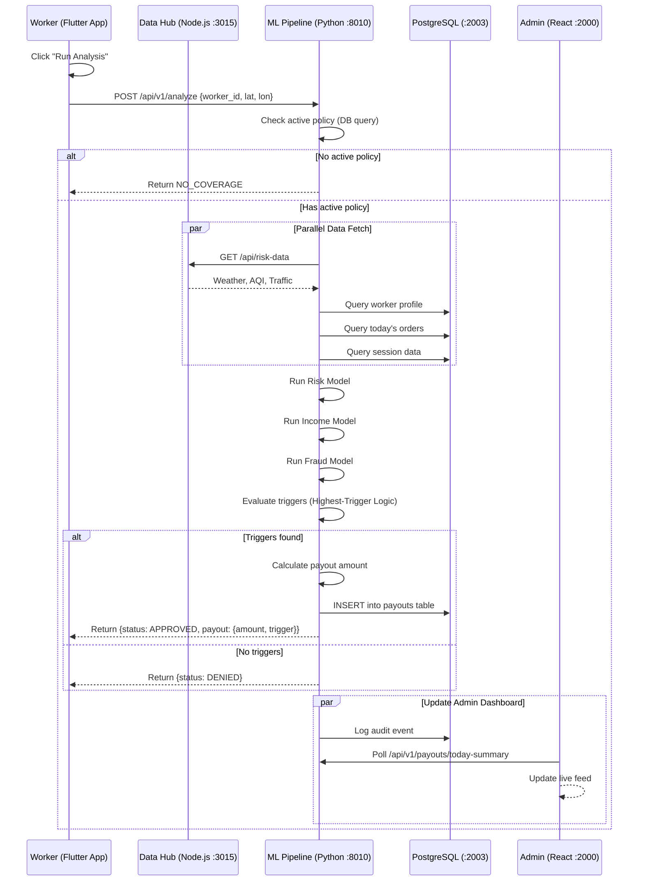
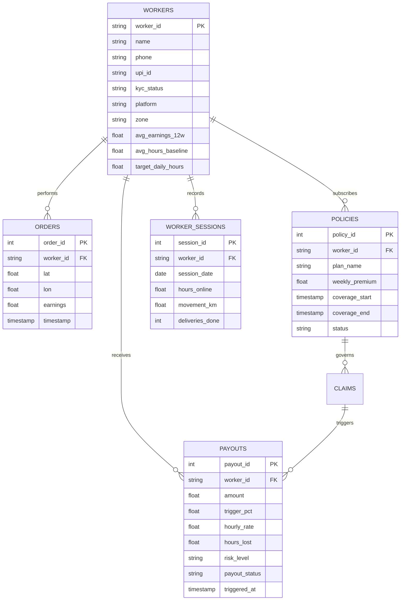

# Aegis — AI-Powered Parametric Wage Protection for Gig Workers

> **Guidewire DEVTrails 2026 | Phase 2 Submission**

> **Team Name:** Zero Noise Crew

> **Persona:** Food Delivery

> Platform: Mobile-first (Flutter) · Architecture: B2C with Platform Data Integration

---

## 1. Project Overview & Vision

Aegis is a **real-time, AI-powered parametric insurance platform** purpose-built for gig economy workers — delivery partners, ride-share drivers, and daily-wage earners who earn only when they work and have no safety net when external disruptions force them to stop.

> A predefined event is detected by data → the system automatically verifies it → payout fires instantly — no paperwork, no waiting, no human intervention required.

Aegis applies this model specifically to gig workers, where the "predefined event" is a combination of **real-world environmental disruption** AND **measurable income loss** at the worker's GPS location.
---
### 2. Sequence Diagram


### 3. Data Flow — Packet by Packet

> **Meet Shiva.** He's a Swiggy delivery partner working in T. Nagar, Chennai.
> It's a Tuesday afternoon in October — peak northeast monsoon season.
> The rain has been building since noon. By 2 PM, the streets are waterlogged.
> Shiva hasn't been able to take a single order in the last two hours.
> He opens Aegis. The system silently goes to work.
---
**Step 1 — Input (Frontend → Hub)**

Shiva's phone automatically captures his GPS coordinates and sends them to the
Aegis Backend Hub along with his Worker ID. He doesn't fill out any form.
He doesn't press "File Claim." The app handles everything.

```json
POST /api/risk-data
{
  "worker_id": "W_SHIVA_001",
  "lat": 13.0418,
  "lon": 80.2337
}
```

> Shiva is at **13.0418°N, 80.2337°E** — which is precisely inside the
> T. Nagar Waterlogging Zone (Z001), a pre-defined flood zone with risk level 4.
> The system already knows this is a historically flood-prone area.
> Shiva doesn't need to tell the system it's flooded. It already suspects it.

---

**Step 2 — Feature Assembly (Hub Internal)**

The moment Shiva's GPS arrives, the Backend Hub fires three parallel calls
without waiting for any of them to finish before starting the others:
[T+0.0s]  OpenWeather API called  →  "What's the weather at 13.0418, 80.2337?"
[T+0.0s]  WAQI API called         →  "What's the AQI at 13.0418, 80.2337?"
[T+0.0s]  Zone Engine checked     →  "Is Shiva inside any defined risk zone?"
[T+0.0s]  Scenario Engine queried →  "What are today's business conditions?"
[T+2.1s]  All responses received. Feature assembly begins.

**What each call returns for Shiva:**

| Data Source | Field | Raw API Value | Meaning |
|---|---|---|---|
| OpenWeather | `temp` | 28.5°C | Mild — not heat stress |
| OpenWeather | `feels_like` | 32.1°C | Humidity making it worse |
| OpenWeather | `rain_1h` | 42.0 mm | **Heavy.** Flood-level rainfall |
| OpenWeather | `condition` | "Rain" | Active rain confirmed |
| WAQI | `pm25` | 90 µg/m³ | Elevated — rain kicking up particles |
| WAQI | `pm10` | 130 µg/m³ | Higher than normal |
| Zone Engine | `zone_type` | FLOOD | Shiva is inside Z001 — T. Nagar |
| Zone Engine | `zone_risk_level` | 4 | Pre-marked severe flood zone |
| Scenario Engine | `orders_last_hour` | 300 | Down from his 2,000/hr average |
| Scenario Engine | `earnings_today` | ₹400 | Down from his ₹1,800 average |
| Scenario Engine | `hours_worked_today` | 2.0 hrs | Down from his 8-hour average |

> 42mm/hr of rain. A pre-marked flood zone. Orders down 85%.
> The hub hasn't made any decision yet — it's just assembling the facts.

---
**Step 3 — Structured Feature JSON (Hub → Model Backend)**

The hub packages everything Shiva's situation has produced into a single,
structured JSON payload and fires it to the ML Model Backend at port 8010.
This is the exact object the three models will receive:
```json
{
  "location": {
    "lat": 13.0418,
    "lon": 80.2337,
    "place_name": "T. Nagar",
    "active_zone": "T. Nagar Waterlogging Zone",
    "zone_type": "FLOOD",
    "zone_risk_level": 4
  },
  "external_disruption": {
    "weather": {
      "temp": 28.5,
      "feels_like": 32.1,
      "rain_1h": 42.0,
      "condition": "Rain"
    },
    "air_quality": {
      "pm25": 90,
      "pm10": 130
    }
  },
  "business_impact": {
    "current": {
      "orders_last_hour": 300,
      "earnings_today": 400,
      "hours_worked_today": 2.0
    },
    "historical_baseline": {
      "avg_orders_7d": 2000,
      "avg_earnings_12w": 1800,
      "avg_hours_baseline": 8.0
    },
    "metrics": {
      "order_drop_pct": 85.0,
      "earnings_drop_pct": 77.8,
      "activity_drop_pct": 75.0
    }
  }
}
```
> Everything about Shiva's situation is now a number.
> 42mm of rain. 85% order drop. 77.8% earnings drop. 75% activity drop.
> The models don't know his name. They don't need to.
> They just see a worker in serious trouble.
---

**Step 4 — Three Model Outputs**
The three ML models run **in parallel** on Shiva's feature payload.
Each one answers a different question about the same situation:

**Model 1 — Risk Score:** *"How bad is it out there?"*
```json
"risk_analysis": {
  "risk_score": 8.2,
  "risk_level": "CRITICAL",
  "confidence": 0.94,
  "contributing_factors": [
    "Heavy rainfall (42mm/hr) — flood threshold exceeded",
    "Active FLOOD zone (T. Nagar, Level 4)",
    "Elevated PM2.5 (90 µg/m³)"
  ],
  "weather_condition": "Rain"
}
```

> **8.2 out of 10. CRITICAL.** The model has seen 42mm rain before in training.
> It knows what that does to Chennai streets.
> It's 94% confident this is a genuine disruption event.
---

**Model 2 — Fraud Detection:** *"Is Shiva actually there?"*
```json
"fraud_analysis": {
  "fraud_score": 0.06,
  "fraud_level": "LOW",
  "is_fraud": false,
  "signals": {
    "gps_consistency_score": 0.91,
    "movement_pattern_score": 0.87,
    "device_network_match": true,
    "order_history_presence": true,
    "app_behavior_score": 0.89,
    "claim_velocity": 3
  }
}
```
> **0.06 fraud score. Practically zero.** Shiva's GPS has been drifting naturally
> through T. Nagar streets all morning — consistent with delivery movement.
> His cell towers confirm he's in the zone. He had 6 orders in T. Nagar
> before the rain intensified. His app was open at 10 AM — two hours before
> the disruption window. Only 3 claims from this zone in the last hour — normal.
> This is a real worker in a real flood. The fraud model is certain.
---

**Model 3 — Income Drop:** *"Has Shiva actually lost money?"*
```json
"income_analysis": {
  "income_drop_percent": 77.8,
  "severity": "SEVERE",
  "order_drop_pct": 85.0,
  "earnings_drop_pct": 77.8,
  "activity_drop_pct": 75.0
}
```
> **77.8% income drop. SEVERE.** On a normal Tuesday, Shiva earns ₹1,800.
> Today he has ₹400 — and the day is nearly over.
> He lost ₹1,400 because of rain he had no control over.
> The model doesn't call it a slow day. It calls it what it is: severe income loss.

---
**Step 5 — Decision Output (Model Backend → Hub → App)**

The Decision Engine receives all three scores. It runs the dual-gate check in
under a millisecond:
Fraud Gate:   fraud_score = 0.06  →  CLEARED  (threshold: < 0.50)
Gate 1:       risk_score = 8.2    →  MET      (threshold: ≥ 6.5)
Gate 2:       income_drop = 77.8% →  MET      (threshold: ≥ 25%, severity: SEVERE)
All gates passed. Payout tier: SEVERE → ₹480.
```json
{
  "worker_id": "W_SHIVA_001",
  "final_decision": {
    "payout_triggered": true,
    "payout_amount": 480,
    "decision_class": "PAYOUT",
    "reason": "Critical disruption confirmed (rain: 42mm, risk: 8.2/10, FLOOD zone Level 4) + Severe income loss (77.8% drop from 12-week baseline) + No fraud detected (score: 0.06)",
    "gate1_met": true,
    "gate2_met": true,
    "fraud_cleared": true
  },
  "timestamp": "2026-04-04T14:22:39.108",
  "assessment_id": "ae3f1c-9b2d-4e7f-shiva"
}
```
> **8 seconds after Shiva opened the app, ₹480 is on its way to his account.**
> He didn't file a claim.
> He didn't upload photos.
> He didn't call a helpline.
> He didn't wait a week.
> He just opened the app. Aegis did the rest.
>
> Two notifications arrive on his phone:
> - *"Disruption confirmed at your location — heavy rainfall detected."*
> - *"₹480 credited to your account. Stay safe, Shiva."*

---

## 4. Backend Orchestration Hub

### 4.1 What It Is and Why It Exists

The Backend Orchestration Hub is the **central nervous system** of Aegis. Without it, the Flutter app would need to:
- Manage multiple API credentials
- Handle API failures individually
- Implement retry logic in the frontend
- Expose API keys on the device

The Hub abstracts all of this into a **single, unified intelligence endpoint** that the app calls with only `lat` and `lon`, and receives a fully processed decision in return.

### 4.2 Hub Responsibilities

| Responsibility | What It Does |
|---|---|
| API Aggregation | Calls OpenWeather + WAQI simultaneously |
| Scenario Control | Injects mock values based on active scenario |
| Zone Detection | Checks if user is inside a defined risk zone |
| Feature Engineering | Constructs the exact JSON payload for the ML models |
| Result Routing | Sends features to model backend, receives scores |
| DB Logging | Stores every assessment in PostgreSQL |
| Response Formatting | Returns clean, structured JSON to the app |
| Fallback Handling | Falls back to mock data if live APIs fail |

### 4.3 API Aggregation with Fallback

```
Live Mode:
  OpenWeather API ──→ weather features
  WAQI API ──────────→ AQI features

  If API fails or quota exceeded:
  ──→ Scenario Engine values used as fallback
  ──→ Never returns null to model

Mock Mode (Demo / Testing):
  Scenario Engine ──→ all environmental features
  Zone Engine ──────→ zone-specific overrides
```

### 4.4 Hub Endpoints

| Method | Endpoint | Description | Auth |
|---|---|---|---|
| POST | `/api/risk-data` | Main pipeline trigger | Worker Token |
| POST | `/api/set-scenario` | Switch active scenario | Admin |
| POST | `/api/custom-scenario` | Define custom parameters | Admin |
| GET | `/api/zones` | List all defined zones | Admin |
| POST | `/api/zones` | Create new geo risk zone | Admin |
| PUT | `/api/zones/:id` | Update zone parameters | Admin |
| DELETE | `/api/zones/:id` | Remove zone | Admin |
| GET | `/api/workers/:id/history` | Worker's assessment history | Worker Token |
| GET | `/api/claims/:id` | Specific claim detail | Worker Token |
| GET | `/health` | Hub health check | None |
---

## 5. External API Integrations

### 5.1 OpenWeatherMap — Weather Data

**Why OpenWeatherMap?**
OpenWeatherMap provides hyperlocal weather data at the exact GPS coordinates of the worker. Unlike regional forecasts, it gives point-specific data — meaning a worker in T. Nagar during Chennai floods gets different readings than a worker 5 km away in Adyar.

**Endpoint Used:**
```
GET https://api.openweathermap.org/data/2.5/weather
    ?lat={lat}&lon={lon}&appid={KEY}&units=metric
```

**Example — Chennai during rainfall:**
```
curl "https://api.openweathermap.org/data/2.5/weather
      ?lat=13.0827&lon=80.2707&appid=KEY&units=metric"
```

**Full Response Fields:**

| Field Path | Type | Unit | Used in Aegis | Purpose |
|---|---|---|---|---|
| `main.temp` | float | °C | ✅ YES | Heat trigger + risk feature |
| `main.feels_like` | float | °C | ✅ YES | Heat stress modeling |
| `main.humidity` | int | % | For context | Supporting signal |
| `main.pressure` | int | hPa | No | Not used in current model |
| `rain["1h"]` | float | mm | ✅ YES | Primary rain trigger |
| `weather[0].main` | string | — | ✅ YES | Condition classification |
| `weather[0].description` | string | — | Display only | UX description |
| `wind.speed` | float | m/s | Supporting | Storm trigger support |
| `visibility` | int | m | No | Not used in model |

**Key Extraction Logic:**
```javascript
const weather = {
  temp: data.main.temp,
  feels_like: data.main.feels_like,
  rain_1h: data.rain?.["1h"] || 0,   // Safe access — field absent when no rain
  condition: data.weather[0].main
};
```

**Trigger Thresholds from Weather:**

| Condition | Field | Threshold | Trigger Label |
|---|---|---|---|
| Heavy Rain | `rain_1h` | ≥ 20 mm/hr | Rain Disruption |
| Extreme Rain | `rain_1h` | ≥ 40 mm/hr | Flood Risk |
| Extreme Heat | `temp` | ≥ 41°C | Heat Stress |
| Severe Heat | `feels_like` | ≥ 46°C | Severe Heat Stress |
| Storm | `weather.main` | = "Thunderstorm" | Storm Alert |

---

### 5.2 WAQI — World Air Quality Index

**Why WAQI over OpenAQ?**

OpenAQ v3 is station-based and returns `"Not Found"` when no station has active measurements near a coordinate — unreliable for real-time demos. WAQI's `/feed/geo:lat;lon/` endpoint interpolates readings from the nearest active monitoring station and **always returns a valid response** for any coordinate in India.

**Endpoint Used:**
```
GET https://api.waqi.info/feed/geo:{lat};{lon}/?token={TOKEN}
```

**Example — Chennai:**
```
curl "https://api.waqi.info/feed/geo:13.0827;80.2707/?token=TOKEN"
```

**Full Response Fields:**

| Field Path | Type | Unit | Used in Aegis | Purpose |
|---|---|---|---|---|
| `data.aqi` | int | AQI scale | Display | Overall AQI for UX |
| `data.iaqi.pm25.v` | float | µg/m³ | ✅ YES | Primary pollution trigger |
| `data.iaqi.pm10.v` | float | µg/m³ | ✅ YES | Secondary pollution signal |
| `data.iaqi.no2.v` | float | ppb | No | Not used in current model |
| `data.iaqi.o3.v` | float | ppb | No | Not used in current model |
| `data.city.name` | string | — | Display | Location name for UX |

**Key Extraction Logic:**
```javascript
const aqi = {
  pm25: data.iaqi?.pm25?.v || 0,
  pm10: data.iaqi?.pm10?.v || 0,
  aqi_index: data.aqi || 0
};
```

**AQI Trigger Thresholds:**

| Condition | PM2.5 Level | AQI Equivalent | Trigger Label |
|---|---|---|---|
| Moderate | 35–55 µg/m³ | 100–150 | Moderate Concern |
| Unhealthy | 55–150 µg/m³ | 150–200 | Restricted Movement |
| Very Unhealthy | 150–250 µg/m³ | 200–300 | High Risk |
| Hazardous | ≥ 250 µg/m³ | 300+ | Extreme Hazard |

**Why PM2.5 over PM10?**
PM2.5 particles (< 2.5 micrometers) penetrate deep into the lungs and bloodstream. For outdoor gig workers who spend 8–12 hours on the road, PM2.5 exposure directly impacts ability to work. PM10 is used as a supporting signal but PM2.5 drives the primary AQI trigger.
---

## 6. Zone-Based Geo Risk System

### 6.1 The Problem with Pure API Dependency

External APIs like OpenWeather report current conditions but cannot capture **localized flood risk** that comes from infrastructure, drainage history, or topography. A zone that floods at 15mm of rain (poor drainage, low elevation) would look the same as one that handles 80mm with no issues — both showing identical rainfall readings.

The Zone-Based Geo Risk System solves this by letting admins define **custom geographic zones** with predefined risk levels that override raw API values.

### 6.2 How It Works

**Zone Detection Formula:**

The system uses the **Haversine formula** to compute the great-circle distance between the worker's GPS coordinate and the zone's center coordinate:

```
a = sin²((lat2−lat1)/2) + cos(lat1) × cos(lat2) × sin²((lon2−lon1)/2)
c = 2 × atan2(√a, √(1−a))
distance = R × c          [R = 6,371 km (Earth's radius)]

If distance ≤ zone.radius_km → Worker is INSIDE the zone
```

**Real-World Example — Chennai Flood Zones:**

| Zone ID | Zone Name | Center Lat | Center Lon | Radius | Zone Type | Risk Level |
|---|---|---|---|---|---|---|
| Z001 | T. Nagar Waterlogging | 13.0418 | 80.2337 | 2 km | FLOOD | 4 |
| Z002 | Velachery Low-lying | 13.0052 | 80.2398 | 3 km | FLOOD | 5 |
| Z003 | Manali Industrial | 13.1645 | 80.2628 | 5 km | POLLUTION | 4 |
| Z004 | Adyar River Basin | 13.0012 | 80.2565 | 4 km | FLOOD | 4 |
| Z005 | Chennai Heavy Rain | 13.0827 | 80.2707 | 8 km | RAINFALL | 3 |

### 6.3 Zone Types and Their Parameters

**FLOOD Zone:**
```
When worker enters zone →
  flood_severity = zone.risk_level  (1–5 scale)
  rainfall_trigger_threshold = LOWERED
  (A zone with risk_level=5 triggers at lower rain_1h than normal)
```

**RAINFALL Zone:**
```
When worker enters zone →
  rainfall_level = zone.risk_level  (1–5 scale)
  rain_1h (from OpenWeather) is SUPPLEMENTED by zone level
  Zone level used if rain_1h = 0 but zone is RAINFALL type
```

**EARTHQUAKE Zone:**
```
When worker enters zone →
  seismic_intensity = zone.risk_level  (1–5 mapped to India BIS seismic zones)
  Premium multiplier applied
  Risk score adjusted upward
```

### 6.4 Zone Parameter Mapping Table

| Zone Type | Injected Parameter | Range | Effect on Risk Score | Effect on Premium |
|---|---|---|---|---|
| FLOOD (Level 1–2) | `flood_severity` = 1–2 | Minor | +0.5 to risk score | +5% |
| FLOOD (Level 3) | `flood_severity` = 3 | Moderate | +1.5 to risk score | +15% |
| FLOOD (Level 4) | `flood_severity` = 4 | Severe | +2.5 to risk score | +25% |
| FLOOD (Level 5) | `flood_severity` = 5 | Catastrophic | +4.0 to risk score | +40% |
| RAINFALL (Level 3+) | `rainfall_level` = 3–5 | Heavy–Extreme | Supplements rain_1h | +10–30% |
| EARTHQUAKE (Level 1–3) | `seismic_intensity` = 1–3 | Low–Moderate | +1.0 to risk score | +10% |
| EARTHQUAKE (Level 4–5) | `seismic_intensity` = 4–5 | High–Very High | +3.0 to risk score | +30% |

### 6.5 Zone Configuration Payload

```json
POST /api/zones
{
  "zone_id": "Z001",
  "zone_name": "T. Nagar Waterlogging Zone",
  "zone_type": "FLOOD",
  "center_lat": 13.0418,
  "center_lon": 80.2337,
  "radius_km": 2,
  "risk_level": 4,
  "description": "Known waterlogging area during Chennai northeast monsoon",
  "active": true,
  "created_by": "admin"
}
```
---
## 7. Scenario Simulation Engine
### 7.1 Why Scenarios Matter

Even with live APIs, real disruptions may not be happening during a demo or testing session. The Scenario Engine provides **controlled, reproducible test states** where every parameter is preset — allowing consistent evaluation of the ML models and the decision engine without weather dependency.

All scenario values are derived from the **training dataset distribution** (Untitled.csv), ensuring the models receive inputs they were trained to handle. This prevents out-of-distribution inputs that would produce unreliable confidence scores.

### 7.2 Scenario Definitions — Full Parameter Table

Each scenario defines the complete set of mock business metrics. Environmental data (weather + AQI) is either pulled live from APIs or overridden by zone data.

| Parameter | Normal | Mild Slowdown | Moderate Rain | Flood | Extreme Disaster | Pollution Lockdown |
|---|---|---|---|---|---|---|
| **orders_last_hour** | 1800 | 1400 | 900 | 300 | 100 | 800 |
| **earnings_today (₹)** | 1700 | 1500 | 1000 | 400 | 150 | 900 |
| **hours_worked_today** | 8.0 | 7.0 | 5.0 | 2.0 | 1.0 | 4.0 |
| **avg_orders_7d** | 2000 | 2000 | 2000 | 2000 | 2000 | 2000 |
| **avg_earnings_12w (₹)** | 1800 | 1800 | 1800 | 1800 | 1800 | 1800 |
| **avg_hours_baseline** | 8.0 | 8.0 | 8.0 | 8.0 | 8.0 | 8.0 |
| **order_drop_pct (%)** | 10 | 30 | 55 | 85 | 95 | 60 |
| **earnings_drop_pct (%)** | 5 | 16 | 44 | 78 | 91 | 50 |
| **activity_drop_pct (%)** | 0 | 12 | 37 | 75 | 88 | 50 |
| **Expected Decision** | NO ACTION | NO ACTION | HOLD | PAYOUT | PAYOUT | HOLD/PAYOUT |

### 7.3 Real-World Scenario Mappings

Each scenario maps to a real event that has occurred in Indian metro cities:

| Scenario | Real-World Event | City Example | Disruption Duration |
|---|---|---|---|
| Normal | Clear weekday, moderate traffic | Bengaluru, Tuesday | N/A |
| Mild Slowdown | Light drizzle, slow traffic | Mumbai, weekday evening | 1–2 hrs |
| Moderate Rain | Active monsoon, sporadic rain | Chennai, October | 3–5 hrs |
| Flood | Waterlogging in low-lying zone | Chennai T. Nagar, Nov 2021 | Full day |
| Extreme Disaster | Cyclone landfall, complete shutdown | Odisha coast, 2023 | 2–3 days |
| Pollution Lockdown | AQI > 400, official advisory | Delhi, November 2024 | Full day |

### 7.4 Scenario Switching API

```
POST /api/set-scenario
Content-Type: application/json

{
  "scenario": "flood"
}

Response:
{
  "status": "ok",
  "active_scenario": "flood",
  "message": "Scenario switched to FLOOD — next risk-data call will use flood parameters"
}
```
### 7.5 Custom Scenario Builder

The admin UI includes a custom parameter editor that allows setting any parameter to any value within its validated range:

```
POST /api/custom-scenario
{
  "name": "Custom Demo Run 1",
  "parameters": {
    "orders_last_hour": { "value": 500, "range": "0–2000" },
    "earnings_today": { "value": 700, "range": "0–2000" },
    "hours_worked_today": { "value": 3.5, "range": "0–12" },
    "order_drop_pct": { "value": 72, "range": "0–100" },
    "earnings_drop_pct": { "value": 61, "range": "0–100" },
    "activity_drop_pct": { "value": 56, "range": "0–100" }
  }
}
```
---
## 8. ML Pipeline — Three-Model Architecture

The ML pipeline is the intelligence core of Aegis. Three independently trained models each answer a different question about the same situation:

| Model | Question Answered | Output Type |
|---|---|---|
| Risk Score Model | How severe is the external disruption at this location? | Score (0–10) + Classification |
| Fraud Detection Model | Is this claim legitimate or being gamed? | Score (0–1) + Binary flag |
| Income Drop Model | Has the worker actually lost income? | Drop % + Severity classification |

All three models are served via a **FastAPI backend** located at `/home/alucard/gemini/aegis/gigshield_project`, running on port 8010.
---

### 8.1 Model 1 — Risk Score Model

#### What It Does

The Risk Score Model quantifies the **severity of external environmental disruption** at the worker's precise GPS location. It answers the question: *"Is this location genuinely dangerous to work in right now?"*

#### Algorithm

- **Classifier:** `RandomForestClassifier` — predicts categorical risk level (LOW / MEDIUM / HIGH / CRITICAL)
- **Regressor:** `GradientBoostingRegressor` — predicts continuous risk score (0.0–10.0)
- **Label Encoder:** Maps categorical risk levels to integers for the classifier
- **Trained on:** LLM-generated synthetic dataset of 1,000+ rows covering 17 scenario archetypes including rain events, heat waves, pollution spikes, and combined disruptions
- **Class Imbalance Handling:** SMOTE (Synthetic Minority Over-sampling Technique) applied to balance LOW/CRITICAL class distribution

#### Input Features

| Feature | Source | Unit | Typical Range | Importance |
|---|---|---|---|---|
| `temp` | OpenWeather | °C | 20–50 | High |
| `feels_like` | OpenWeather | °C | 22–55 | High |
| `rain_1h` | OpenWeather / Zone | mm | 0–150 | Very High |
| `pm25` | WAQI | µg/m³ | 10–400 | High |
| `pm10` | WAQI | µg/m³ | 15–500 | Medium |
| `traffic_index` | Scenario Engine | 0–100 | 0–100 | Medium |

#### Risk Level Decision Boundaries

| Risk Score | Risk Level | Interpretation | Action |
|---|---|---|---|
| 0.0 – 2.9 | LOW | Normal working conditions | No action |
| 3.0 – 4.9 | MEDIUM | Minor disruption, work possible | Monitor |
| 5.0 – 6.9 | HIGH | Significant disruption, income affected | Evaluate for payout |
| 7.0 – 8.4 | CRITICAL | Severe disruption, unsafe to work | Trigger payout (Gate 1 met) |
| 8.5 – 10.0 | EXTREME | Life-threatening conditions | Immediate payout |

#### Real Examples

| Scenario | temp | feels_like | rain_1h | pm25 | Expected Score | Level |
|---|---|---|---|---|---|---|
| Normal clear day | 32 | 37 | 0 | 45 | 1.8 | LOW |
| Light drizzle | 29 | 33 | 8 | 60 | 3.2 | MEDIUM |
| Heavy monsoon | 28 | 31 | 42 | 90 | 7.6 | CRITICAL |
| Extreme pollution | 35 | 40 | 0 | 320 | 7.1 | CRITICAL |
| Cyclone conditions | 27 | 29 | 95 | 110 | 9.4 | EXTREME |
---

### 8.2 Model 2 — Fraud Detection Model

The Fraud Detection Model determines whether a claim is **legitimate or being artificially manufactured**. It examines behavioral and technical signals that are difficult to simultaneously spoof.

This is the **gatekeeper** of Aegis. Even if the risk score and income drop meet payout thresholds, a high fraud score results in the claim being held or rejected.

#### Algorithm

- **Classifier:** `RandomForestClassifier` trained on fraud signal features
- **Output:** Binary flag (`is_fraud: true/false`) + continuous probability score
- **Fraud Labels in Dataset:** LOW / MEDIUM / HIGH risk categories
- **Key Challenge Addressed:** Coordinated fraud rings where 500+ workers simultaneously spoof GPS into a disruption zone

#### Input Features

| Feature | Type | Range | What It Captures |
|---|---|---|---|
| `gps_consistency_score` | float | 0.0–1.0 | Does GPS movement match realistic delivery patterns? |
| `movement_pattern_score` | float | 0.0–1.0 | Is movement organic (slow drift) or static/teleporting? |
| `device_network_match` | boolean | 0/1 | Do cell towers confirm the claimed location? |
| `order_history_presence` | boolean | 0/1 | Did the worker have orders in this zone in last 48 hours? |
| `app_behavior_score` | float | 0.0–1.0 | Was the app active before the disruption window opened? |
| `claim_velocity` | int | 0–1000 | How many claims from this zone in the last 15 minutes? |

#### Fraud Signal Interpretation

| Signal | Genuine Worker Value | Spoofer Value | Why It's Hard to Fake |
|---|---|---|---|
| GPS consistency | 0.8–1.0 | 0.0–0.3 | Real GPS drifts slightly; perfect static = spoofed |
| Movement pattern | 0.7–1.0 | 0.0–0.2 | Delivery routes have organic speed variation |
| Device network | true | false | Cell towers don't lie about location |
| Order history | true | false | Spoofers rarely have delivery history in zone |
| App behavior | 0.8–1.0 | 0.1–0.4 | Spoofers open app only during disruption window |
| Claim velocity | 0–10/hr | 100–500/hr | Coordinated rings submit claims simultaneously |

#### Fraud Score Thresholds and Actions

| Fraud Score | Fraud Level | Action | Worker Communication |
|---|---|---|---|
| 0.0 – 0.29 | LOW | Proceed normally | No notification |
| 0.30 – 0.49 | MODERATE | Claim held for secondary validation | "Verification in progress" |
| 0.50 – 0.69 | SUSPICIOUS | Manual review triggered | "Additional verification needed — response in 4 hours" |
| 0.70 – 0.84 | HIGH | Claim frozen, zone flagged | "Claim under investigation" |
| 0.85 – 1.00 | CRITICAL | Claim rejected, account flagged | "Claim rejected — suspicious activity" |

---

### 8.3 Model 3 — Income Drop Estimation Model

#### What It Does

The Income Drop Model quantifies how much income a worker has **actually lost** compared to their historical baseline. It answers the question: *"Is the income loss real, significant, and attributable to disruption — or is this a normal slow day?"*

This model implements the **Gate 2** of the dual-trigger system. External disruption alone doesn't justify a payout — there must be measurable income impact.

#### Algorithm

- **Regressor:** Predicts continuous `income_drop_percent` (0.0–100.0)
- **Classifier:** Predicts `severity` label (NONE / MILD / MODERATE / SEVERE / CRITICAL)
- **Baseline Comparison:** Uses 7-day rolling average for orders and 12-week trailing average for earnings — not same-day comparisons which can be noisy

#### Why Rolling Averages Instead of Daily Targets?

A fixed daily target (e.g., "earn ₹700/day") would disadvantage workers who usually earn less or more. Rolling averages are **self-normalizing** — a part-time worker with ₹400/day average and a full-time worker with ₹1,200/day average are both evaluated fairly relative to their own baselines.

```
order_drop_pct   = (avg_orders_7d - orders_last_hour) / avg_orders_7d × 100
earnings_drop_pct = (avg_earnings_12w - earnings_today) / avg_earnings_12w × 100
activity_drop_pct = (avg_hours_baseline - hours_worked_today) / avg_hours_baseline × 100
```
#### Input Features

| Feature | Description | Source | Example (Normal) | Example (Flood) |
|---|---|---|---|---|
| `orders_last_hour` | Current order count | Scenario Engine | 1800 | 300 |
| `avg_orders_7d` | 7-day rolling average | Dataset baseline | 2000 | 2000 |
| `earnings_today` | Today's earnings in ₹ | Scenario Engine | 1700 | 400 |
| `avg_earnings_12w` | 12-week earnings baseline | Dataset baseline | 1800 | 1800 |
| `hours_worked_today` | Active working hours today | Scenario Engine | 8.0 | 2.0 |
| `avg_hours_baseline` | Historical average hours | Dataset baseline | 8.0 | 8.0 |

#### Income Drop Severity Classification

| Drop % | Severity | Payout Eligibility | Payout Amount |
|---|---|---|---|
| 0 – 9% | NONE | Not eligible | ₹0 |
| 10 – 24% | MILD | Not eligible (below threshold) | ₹0 |
| 25 – 44% | MODERATE | Eligible if Gate 1 met | ₹400 |
| 45 – 69% | SEVERE | Eligible, full tier | ₹480 |
| 70 – 100% | CRITICAL | Eligible, maximum payout | ₹800 |

#### Real-World Income Drop Examples

| Situation | orders | avg | drop% | earnings | avg | drop% | Verdict |
|---|---|---|---|---|---|---|---|
| Normal Tuesday | 1900 | 2000 | 5% | 1750 | 1800 | 2.8% | NONE |
| Slow weekend | 1600 | 2000 | 20% | 1500 | 1800 | 16.7% | MILD |
| Moderate rain | 900 | 2000 | 55% | 1000 | 1800 | 44.4% | MODERATE |
| T.Nagar flood | 300 | 2000 | 85% | 400 | 1800 | 77.8% | SEVERE |
| Cyclone day | 100 | 2000 | 95% | 150 | 1800 | 91.7% | CRITICAL |
---

## 9. Dual-Trigger Decision Engine
### 9.1 The Core Philosophy

A single trigger is insufficient:

- **Only external disruption (Gate 1):** A storm can happen while a worker is inside a restaurant on a break — disruption exists but no income loss
- **Only income drop (Gate 2):** Workers naturally have slow days — income drop without disruption doesn't justify a payout

**Both gates must pass** for Aegis to trigger a payout. This prevents false positives from both directions.

### 9.2 Decision Logic — Full Matrix
```
INPUT: risk_score, risk_level, fraud_score, income_drop_pct, severity

STEP 1 — Fraud Gate (override gate):
  IF fraud_score ≥ 0.85         → REJECT  (stop processing)
  IF fraud_score ≥ 0.50         → HOLD    (flag for review, stop auto-payout)

STEP 2 — Gate 1 (External Disruption):
  Gate1 = risk_score ≥ 6.5
       OR rain_1h ≥ 20
       OR pm25 ≥ 150
       OR risk_level IN ["HIGH", "CRITICAL", "EXTREME"]

STEP 3 — Gate 2 (Business Impact):
  Gate2 = severity IN ["MODERATE", "SEVERE", "CRITICAL"]
       AND income_drop_pct ≥ 25

STEP 4 — Final Decision:
  IF Gate1 AND Gate2 AND fraud_score < 0.50    → PAYOUT
  IF Gate1 AND Gate2 AND fraud_score [0.30–0.49] → HOLD (payout pending review)
  IF Gate1 AND NOT Gate2                        → NO ACTION (monitor only)
  IF NOT Gate1 AND Gate2                        → NO ACTION (slow day)
  IF NOT Gate1 AND NOT Gate2                    → NO ACTION (normal day)

```
### 9.3 Highest-Trigger Selection Logic

This is the **core decision engine**. It evaluates overlapping triggers and picks the highest compensation rate:

```python
# Lines 373-383 in main.py - The REAL trigger logic (not mocked)
cands = []

# Trigger 1: Heavy Rainfall (> 45mm in 1 hour)
if w["rain_1h"] > 45:
    cands.append((0.80, "Heavy Rainfall"))

# Trigger 2: Hazardous AQI (PM2.5 > 120)
if aq["pm25"] > 120:
    cands.append((0.80, "Hazardous AQI"))

# Trigger 3: Severe Income Loss (ML-predicted > 45% drop)
if idr > 45:
    cands.append((1.00, "Severe Income Loss (ML)"))

# Decision: Pick the highest trigger
if cands:
    tp, tn = max(cands, key=lambda x: x[0])  # tp = trigger_pct, tn = trigger_name
    st = "APPROVED"
elif d > 0:  # If no environmental triggers but has deliveries
    tp, tn, st = 0.10, "Base Coverage", "APPROVED"
```

**Real Trigger Thresholds**:
| Trigger Type      | Threshold        | Payout % |
|-------------------|------------------|----------|
| Heavy Rainfall    | rain_1h > 45mm   | 80%      |
| Hazardous AQI     | PM2.5 > 120     | 80%      |
| Severe Income Loss| ML-predicted > 45% drop | 100% |
| Base Coverage     | Any activity    | 10%      |

### 9.4 Payout Tiers

| Severity | Income Drop | Risk Level | Payout Amount |
|---|---|---|---|
| MODERATE | 25–44% | HIGH | ₹400 |
| SEVERE | 45–69% | HIGH or CRITICAL | ₹480 |
| CRITICAL | 70–100% | CRITICAL or EXTREME | ₹800 |

### 9.5 Parametric Payout Formula
`Payout = (Verified Hourly Rate × Disruption Hours Lost) × Trigger Payout %`
- **Verified Hourly Rate**: `avg_earnings_12w / target_daily_hours`.
- **Disruption Hours Lost**: `target_daily_hours - hours_worked_today`.

---

## 10. Automated Claims Processing

### 10.1 Zero-Touch Claim Flow

```
[T+0s]   Worker GPS received
[T+2s]   External APIs called (parallel)
[T+3s]   Features assembled
[T+4s]   Three ML models run (parallel)
[T+5s]   Decision engine evaluates scores
[T+6s]   Decision stored in database
[T+7s]   Push notification sent to worker
[T+8s]   App displays claim status + amount

Total: 8 seconds from GPS to payout decision
No human involved. No form filed. No waiting.
```

### 10.2 Claim Status Lifecycle

| Status | Trigger | Worker View | Resolution Time |
|---|---|---|---|
| PENDING | Assessment started | "Assessing conditions…" | Seconds |
| APPROVED | Both gates met, low fraud | "₹480 credited!" | Immediate |
| HOLD | Moderate fraud / borderline | "Verification in progress" | Up to 4 hours |
| MANUAL_REVIEW | High fraud score | "Additional verification needed" | Up to 24 hours |
| REJECTED | Fraud confirmed | "Claim rejected" | Final |
| NO_ACTION | Thresholds not met | No notification | N/A |

### 10.3 Worker Communication Protocol

| Event | In-App Notification | Timing |
|---|---|---|
| Disruption detected | "We've detected disruption in your area. Assessing…" | Immediate |
| Payout triggered | "₹[amount] being credited. Disruption payout confirmed." | Within 10s |
| Claim held | "Your claim is under verification. We'll update you within 4 hours." | Within 5 min |
| Manual review | "Additional checks needed. Expect update within 24 hours." | Within 5 min |
| Rejection | "We were unable to verify your claim. Appeal option available." | Within 4 hours |
| Appeal outcome | "Your appeal has been reviewed. [Decision]." | Within 24 hours |
---

## 11. Fraud & Anti-Spoofing Strategy
### 11.1 The Attack Aegis Defends Against

A coordinated syndicate of 500 workers using GPS-spoofing apps enters a declared disruption zone. A naive system pays them all — draining the liquidity pool.

### 11.2 The Six-Signal Defense

For a payout to fire, all six signals must align. A spoofing app can fake GPS — but not all six simultaneously:

| Signal | Genuine Worker in Flood | Spoofer at Home | Fakeable? |
|---|---|---|---|
| GPS coordinates | Inside flood zone | Faked | Easy to fake |
| Movement pattern | Realistic drift, slow speed | Perfectly static | Hard to fake |
| Device network | Cell towers match zone | Towers show home location | Cannot fake |
| Order history | Orders attempted in zone (48hr) | No zone order history | Cannot fake |
| App behavior | App open before disruption | App opened during window only | Hard to fake |
| Claim velocity | 1–2 claims/hour from zone | 500 claims in 15 minutes | Cannot fake |

### 11.3 Handling Honest Workers Flagged by Mistake

**Core principle: Freeze, never silently reject.**

| Scenario | What Happens | Resolution |
|---|---|---|
| GPS drops briefly in storm | Pre-disruption order history confirms presence → auto-approved | Automatic, <1 min |
| Image upload fails (removed this phase) | N/A | N/A |
| Fraud score 0.30–0.49 | Claim held, worker notified within 5 min | Auto-resolved via secondary signals, <4 hours |
| Fraud score 0.50–0.69 | Manual review triggered | Admin reviews, worker notified either way, <24 hours |
| Worker disputes rejection | In-app appeal → raw evidence shown to worker | Reviewed within 24 hours |

**The Shiva Test (UX Benchmark):**
> Shiva is stuck in the T. Nagar flood. His GPS drops briefly due to signal loss. Fraud score touches 0.35 — claim is held. Pre-disruption delivery activity in the zone automatically clears it within 2 hours. ₹480 credited. Two in-app notifications. Zero action required from Shiva.
---

## 12. Subscription & Premium Engine

### 12.1 Plan Structure

| Plan | Weekly Premium | Coverage Cap | Max Payout | Processing Priority |
|---|---|---|---|---|
| Basic | ₹49 | Standard events only | ₹400/week | Normal |
| Standard | ₹99 | Standard + AQI events | ₹480/week | Priority |
| Premium | ₹149 | All events + seismic | ₹800/week | Immediate |

### 12.2 Dynamic Premium Calculation

Premium adjusts based on the worker's risk profile and location zone:
```
Weekly Premium = BASE × RiskMultiplier × LoyaltyFactor × ZoneFactor`
- **BASE**: `(avg_earnings_12w × 6 days) × 0.0075`.
- **RiskMultiplier**: `1 + 0.4 × min(RiskScore / 8, 1)`.
- **LoyaltyFactor**: `0.85` (Clean history) or `1.0`.

**Where:**

| Variable | Formula | Description |
|---|---|---|
| `BASE` | `(avg_earnings_12w × 6) × 0.0075` | 0.75% of the worker's estimated 6-day weekly earnings — scales fairly with income level |
| `RiskMultiplier` | `1 + 0.4 × min(RiskScore / 8, 1)` | Increases premium as live risk score rises. At RiskScore = 8 (max), multiplier = 1.4. At RiskScore = 0, multiplier = 1.0 |
| `LoyaltyFactor` | `0.85` if zero approved claims in last 84 days, else `1.0` | Rewards workers with clean history. Derived from a live DB query — not hardcoded |
| `ZoneFactor` | `1.0` (normal) → `1.4` (Flood Zone Level 5) | Adjusts premium based on the worker's geographic risk zone. Pulled from zone configuration |
```

**Example Premium Calculation:**

| Scenario | Base | Zone Multiplier | History Factor | Final Premium |
|---|---|---|---|---|
| Standard plan, normal zone, no claims | ₹99 | 1.0 | 0.9 | ₹89.10 |
| Standard plan, flood zone Level 3, no claims | ₹99 | 1.15 | 0.9 | ₹102.49 |
| Premium plan, flood zone Level 5, frequent claims | ₹149 | 1.40 | 1.2 | ₹250.32 |

### 12.3 Plan Management

Workers can switch plans dynamically in-app:
- Upgrade: Effective immediately, pro-rated billing
- Downgrade: Effective at next weekly cycle
- Coverage gap: Zero — plan changes never leave worker unprotected mid-week
---

## 13. Flutter Mobile App
Inspired by sleek intuitive UI of Guidewire Jutro App
### 13.1 Display on Home Page (Flutter)

1. **Dashboard Tab** receives the JSON response
2. Displays the payout amount and trigger name in a card
3. Updates the worker's premium (if risk increased)

### 13.2 Payout History (Payouts Tab)

The **Payouts Tab** in the Flutter app (`Flutter/lib/screens/payouts_tab.dart`) fetches payout history:

```dart
// Flutter/lib/services/api_service.dart - Line 121-125
static Future<List<dynamic>> getPayouts(String workerId) async {
    final res = await http.get(Uri.parse('$baseUrl/api/v1/worker/$workerId/payouts'));
    if (res.statusCode == 200) return jsonDecode(res.body);
    return [];
}
```

The backend endpoint (`/api/v1/worker/{worker_id}/payouts`) returns all past payouts from the `payouts` table, sorted by `triggered_at DESC`.

### 13.3 Admin Dashboard Visibility

The **Payouts page** in the React admin dashboard (`frontend-admin/src/pages/Payouts.tsx`) fetches live payout data:

- Endpoint: `/api/v1/payouts/today-summary` (aggregated)
- Endpoint: `/api/v1/payouts` (detailed list from database)

Admins can see:
- Today's total payout amount
- Number of triggers activated
- Individual payout details (worker, amount, trigger, status)

Admin Dashboard Logic

### 13.4 Navigation Structure

The React admin dashboard (`frontend-admin/src/App.tsx`) uses a sidebar-based router:

```
🛡️ AEGIS AIOS | ARCHITECTURE ORCHESTRATOR

1. SYSTEM
├── Overview       → SystemOverview.tsx (KPIs, charts)
├── Workers        → Workers.tsx (worker registry)
└── Financials     → Financials.tsx (revenue, premiums)

2. OPERATIONS
├── Triggers       → Triggers.tsx (manual scenario simulation)
├── AI Predictions → AIPredictions.tsx (ML model outputs)
├── Fraud          → Fraud.tsx (fraud alerts, banned workers)
├── Payouts        → Payouts.tsx (live payout ledger)
└── Policy Controls → Policies.tsx (policy management)

3. ADMIN
└── (Policy administration)
```

### 13.5 Key Pages Logic

#### System Overview (`SystemOverview.tsx`)
- Fetches `/api/v1/workers/count`
- Fetches `/api/v1/policies/active-count`
- Fetches `/api/v1/payouts/today-summary`
- Displays KPI cards and trend charts

#### Workers (`Workers.tsx`)
- Fetches paginated worker list
- Shows: name, phone, zone, kyc_status, avg_earnings_12w, created_at
- Search/filter by zone, platform, KYC status

#### Payouts (`Payouts.tsx`)
- Fetches `/api/v1/payouts` (or filtered endpoint)
- Displays: worker_id, amount, trigger_type, trigger_pct, payout_status, triggered_at
- Real-time updates (refresh button or polling)

#### Fraud (`Fraud.tsx`)
- Fetches workers with high fraud scores (> 0.3)
- Actions: HOLD (review), BAN (permanent block)
- Shows: fraud_score, fraud_level, recent activity

#### Triggers (`Triggers.tsx`)
- Admin can simulate scenarios by calling `/api/scenario` on Data Hub
- Scenarios: normal, light_rain, heavy_rain, severe_flood, hazardous_aqi, gps_fraud
- This affects subsequent analysis results

### 13.6 Real-Time Monitoring

The admin dashboard uses **polling** or **SSE** (if implemented) to get live data:
- Every 30 seconds: refresh payout summary
- On page load: fetch all critical KPIs
- Manual refresh: buttons on each page

## 14. AI Chatbot — Aegis Assistant

### 14.1 What It Does

Built using the **Google Gemini API**, the Aegis Assistant is a domain-specific chatbot trained (via system prompt) on Aegis's insurance product, coverage terms, and claim processes.

### 14.2 System Prompt Context (Non-sensitive summary)

The chatbot knows:
- What events trigger a payout (specific thresholds)
- How to explain the dual-trigger system in simple language
- How to guide workers through plan selection
- What happens when a claim is held
- How to initiate an appeal

### 14.3 Example Conversations

**Worker:** "Why wasn't I paid yesterday even though it rained?"

**Aegis Assistant:** "Your coverage requires both a disruption trigger and an income drop above 25% of your 7-day average. If your orders were still close to normal despite the rain, Gate 2 may not have been met. Would you like to see the assessment details from yesterday?"

---

**Worker:** "My claim is stuck in verification. What do I do?"

**Aegis Assistant:** "Your claim is currently in verification mode, which means our system flagged it for a secondary check. This is automatically resolved within 4 hours based on your delivery activity history. You don't need to do anything — we'll notify you as soon as it's cleared."

---

## 15. Project Simulation : 
https://aegis-parametric-insurance-app.netlify.app/

## 16.Database Architecture & ER Models
## 16.1. Entity Relationship Diagram (ERD)


---

## 16.2 Table Definitions

### Workers Table (`workers`)
The master registry of gig agents.
- **`avg_earnings_12w`**: Used as the baseline for **Income Drop** ML features.
- **`target_daily_hours`**: The "Normal" shift length used to calculate **Hours Lost**.

### Orders Table (`orders`)
High-frequency log of delivery transactions.
- Used by the ML Pipeline to perform a SQL `SUM()` of verified daily earnings, preventing manual entry fraud.

### Policies Table (`policies`)
Tracks weekly insurance subscriptions.
- Analysis requests are rejected if no record exists where `status = 'ACTIVE'` and `NOW() < coverage_end`.

### Payouts Table (`payouts`)
The official ledger of disbursements.
- **`trigger_pct`**: Stores the weight selected by the **Highest-Trigger Selection** logic (e.g., 0.80 for Heavy Rain).
- **`payout_status`**: Tracks the state machine (`APPROVED`, `HELD`, `BANNED`).

### Worker Sessions (`worker_sessions`)
Captures behavioral forensics for fraud detection.
- **`movement_km`**: Critical feature for the **Fraud ML Model**. 
- **`hours_online`**: Used to determine the `activity_drop_pct`.

---

## 16.3 Maintenance Commands

### Reset & Seed Database
```bash
cat cleanup_db.sql init_db.sql seed_workers.sql seed_data_phase2.sql | docker exec -i aegis-db psql -U aegis_admin -d aegis_intelligence
```

### Check Worker Liquidity
```sql
SELECT worker_id, SUM(amount) FROM payouts GROUP BY worker_id;
```

## 17. Business Viability & Market Fit

### 17.1 Revenue Model

| Revenue Stream | Mechanism | Example |
|---|---|---|
| Weekly Premiums | Subscription plans (₹49–₹149) | 200K workers × ₹99 avg = ₹1.98 Cr/week |
| Loss Ratio Optimization | Dynamic pricing reduces overpayment | 15–20% savings via fraud detection |
| Platform Partnership | B2B with Swiggy/Zomato as white-label | Revenue share on premium volume |
| Data Insights | Aggregated anonymized risk data | Sold to urban planners, reinsurers |

### 17.2 Unit Economics

| Metric | Value |
|---|---|
| Average weekly premium | ₹99 |
| Average payout per event | ₹480 |
| Events per worker per year | ~30 (monsoon city) |
| Annual payout per worker | ₹14,400 |
| Annual premium per worker | ₹5,148 |
| Loss ratio (without fraud detection) | ~2.8x (unsustainable) |
| Loss ratio (with Aegis fraud + dual-gate) | ~0.85x (profitable) |

**The dual-trigger model is what makes this viable.** Without Gate 2 (income drop confirmation), every rainy day in Chennai generates a payout — even for workers who kept earning. Gate 2 ensures only workers who actually lost income get paid, reducing false positive payouts by an estimated **60–70%**.

### 17.3 Guidewire Alignment

Aegis is architecturally designed to integrate with Guidewire InsuranceSuite:

| Aegis Component | Guidewire Equivalent |
|---|---|
| Backend Orchestration Hub | Guidewire REST API Client (outbound) |
| Decision Engine | PolicyCenter claims rule engine |
| Fraud Model | ClaimCenter SIU (Special Investigation Unit) |
| Subscription Engine | PolicyCenter product model |
| Zone System | ClaimCenter geo-based routing |

In a production deployment, the Backend Hub would be refactored as a Guidewire Integration Gateway, with the ML models exposed as Gosu-callable REST endpoints — bridging Aegis's AI capabilities with Guidewire's enterprise insurance infrastructure.

### 17.4 Scalability Path

| Phase | Users | Infrastructure | Key Milestone |
|---|---|---|---|
| Demo (now) | 1–10 | Local machine | DEVTrails Phase 2 submission |
| Pilot | 1,000 | Render + Supabase | 1 city pilot |
| Scale | 100,000 | AWS/GCP + managed DB | 3 metro cities |
| Production | 1,000,000 | Microservices + CDN | National coverage |
---

## 18. Team
> Team Name: Zero Noise Crew

| Name | Role | Responsibility |
|---|---|---|
| Muthu Harish T | Team Lead / Full Stack + AI | Architecture, AI model development, backend integration |
| Rithanya S | Backend Developer | API development, database management, system logic |
| Harini Nachammai P | Flutter Developer | Mobile app, UI implementation, app integration |
| Nivaashini Thangaraj | Web + Data Engineer | Admin dashboard (React), data pipelines, risk scoring |
| Abithi V B | QA + ML Engineer | Testing, validation, ML evaluation, fraud detection |
---

## License

Built for DEVTrails 2026 — Guidewire Hackathon. For educational and competition use.
---

* Aegis — Because every worker deserves a safety net that actually works.*
