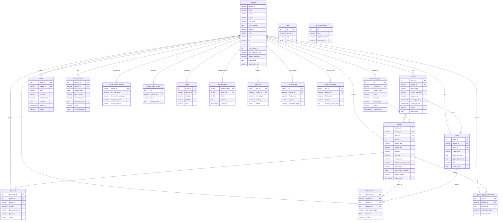

# 🛡️ Aegis — AI-Powered Parametric Wage Protection for Gig Workers

> **Guidewire DEVTrails 2026 | Phase 3 Submission**
> **Team:** Zero Noise Crew | **Persona:** Food Delivery

---

Pitch Deck : [https://github.com/harish040120/Aegis/blob/main/TEAM%20ZERO%20NOISE%20CREW.pdf]

## 1. The Problem

India has over 5 million active food delivery partners. They earn only when they ride. A single rain event, a red-alert pollution day, or a sudden curfew can wipe out an entire dinner rush — with zero recourse.

Shiva delivers for Zomato full-time, averaging ₹700–₹1,000/day across 8–10 hours. During Chennai's northeast monsoon (October–December), a flooded evening costs him ₹400–₹600. He has no insurance, no sick pay, no employer. When disruption hits, he absorbs 100% of the loss.

**Workers like Shiva lose 20–30% of monthly income to uncontrollable disruptions.**

### Shiva's Reality by Scenario

| Scenario | Disruption | What Happens to Shiva | Aegis Response |
|---|---|---|---|
| Northeast monsoon flood | Rainfall >65mm, IMD red alert | Roads waterlogged, zero orders for 3 hrs | Auto-payout for dinner rush loss |
| T. Nagar heat crisis | Temp >41°C + activity drop >25% | Lunch rush impossible, unsafe to ride | Heat + activity drop trigger fires |
| Cyclone warning | IMD cyclone alert, wind >60km/h | Platform suspends zone, all riders offline | Cyclone trigger fires, instant credit |
| Local curfew | Section 144, zone sealed | All riders go offline in cluster | Geospatial anomaly detected, payout approved |

---

## 2. How Aegis Works — The Big Picture

Shiva downloads the Aegis app once. He registers, picks a plan, and pays ₹34 for his first week. From that moment, everything is automatic.

Aegis pulls his zone, monitors weather and order volumes in real time, and credits his UPI wallet the moment a trigger fires. He never opens the app to file a claim.

```
SHIVA'S PHONE (Flutter App)
    ↕ onboarding, coverage view, payout notifications
AEGIS BACKEND (FastAPI + Node.js Hub)
    ↕ earnings data, GPS, zone           ↕ weather, AQI, civic alerts
  PostgreSQL (Worker Data)         OpenWeatherMap + IMD + CPCB
```

**Why a dedicated app, not embedded in Zomato or Swiggy:**
Shiva multi-apps across Zomato and Swiggy. A single Aegis app gives him unified coverage across both platforms. Aegis owns the worker relationship directly.

---

## 3. Feature 1: Zone Locking — Shiva Claims His Territory

### The Story

When Shiva first registers, the app asks him to allow location access. He taps "Allow." His GPS places him at 13.0827° N, 80.2707° E — the heart of T. Nagar, Chennai. The app shows a confirmation screen: **"Confirm Zone: Chennai-Central."**

Shiva taps Confirm. That's it. His zone is locked.

Why does this matter? Because a week later, Shiva decides to try a busier area and rides over to Chennai-South for a few hours. Aegis sees his GPS drift. But it doesn't immediately change his zone — that would let bad actors fake zone changes to claim payouts for disruptions in other areas.

Instead, Aegis silently watches. If Shiva spends more than **30 minutes** in Chennai-South AND has actual delivery orders there, the zone is promoted. If he's just passing through, nothing changes.

### How It's Built

#### Flutter App (`lib/screens/register_screen.dart`)

During registration **Step 3 (Location)**, the app:

1. Requests GPS permission via `geolocator`.
2. Calls `POST /api/v1/detect-zone` with current coordinates.
3. Displays a big confirmation card: zone name + coordinates.
4. On user tap → calls `POST /api/v1/register/location`.

```dart
// lib/services/api_service.dart
Future<String> registerLocation({
  required String workerId,
  required double lat,
  required double lon,
  required String zone,
}) async {
  final data = await _post('/register/location', {
    'worker_id': workerId,
    'lat': lat,
    'lon': lon,
    'zone': zone,
  });
  return data['registration_step'];
}
```

After this call succeeds, Shiva's `registration_step` is set to `DONE` in the database and he moves to the Plan selection screen.

#### Backend (`POST /api/v1/register/location`)

```sql
UPDATE workers
  SET zone = $1, lat = $2, lon = $3,
      lat_last = $2, lon_last = $3,
      registration_step = 'DONE'
WHERE worker_id = $4;
```

#### Zone Drift Detection (`POST /api/v1/session-ping`)

Every minute while Shiva is online, his Flutter app sends a background ping with his current GPS. The backend runs this logic silently:

```
New GPS → Determine current zone
Current zone ≠ Locked zone?
  → Set zone_change_detected_at = NOW(), pending_new_zone = current zone

zone_change_detected_at > 30 minutes ago?
  → Check orders table: any orders in pending_new_zone?
    → YES → Promote: UPDATE workers SET zone = pending_new_zone
    → NO  → Reject drift, clear pending state
```

Shiva's coverage follows him legitimately — without ever being exploited.

#### Database Schema

Key columns on the `workers` table:

| Column | Purpose |
|---|---|
| `zone` | Locked home zone |
| `lat`, `lon` | Home-base coordinates |
| `lat_last`, `lon_last` | Latest GPS from session ping |
| `registration_step` | `PHONE → OTP → PROFILE → INCOME → LOCATION → DONE` |

---

## 4. Feature 2: Real-Time Metrics — Aegis Watches While Shiva Rides

It's 7:30 PM on a Tuesday. Shiva is on his 6th delivery of the evening. Dark clouds have been building over Chennai for the last hour. He doesn't know it yet, but the IMD just issued an orange alert — 52mm of rain has fallen in the last hour in Chennai-Central.

On Shiva's phone, the Aegis app has been quietly polling every 30 seconds. It just received this response from the backend:

```json
{
  "risk_score": 7.4,
  "risk_level": "CRITICAL",
  "income_drop": 62.1,
  "income_severity": "SEVERE",
  "active_alert": {
    "type": "Heavy Rainfall",
    "severity": "high",
    "claimed": true,
    "expires_at": "2026-04-18T20:05:00Z"
  }
}
```

The app immediately shows a banner: **"🌧️ Heavy Rainfall Detected — Parametric payout triggered automatically."**

Shiva hasn't pressed a single button. The money is already moving.

### How It's Built

#### Flutter App — Polling Timer (`lib/screens/home_screen.dart`)

```dart
@override
void initState() {
  super.initState();
  _loadMetrics();
  _metricsTimer = Timer.periodic(
    const Duration(seconds: 30),
    (_) => _loadMetrics(),
  );
}

Future<void> _loadMetrics() async {
  final api = context.read<AuthProvider>().api;
  final data = await api.getLiveMetrics(widget.workerId);
  setState(() => _live = data);
}
```

If the response contains an `active_alert`, the `_AutoPayoutBanner` widget renders immediately. The timer is cancelled in `dispose()` to prevent memory leaks.

#### Backend — Live Metrics Endpoint (`GET /api/v1/live-metrics/{worker_id}`)

The endpoint does five things in sequence:

1. Fetches Shiva's locked zone and last known GPS from the `workers` and `worker_sessions` tables.
2. Calls the Node.js Data Hub at `GET /api/risk-data?lat=...&lon=...&worker_id=W001`.
3. Feeds the environmental data into the ML models (XGBoost risk, income drop regressor, Isolation Forest fraud detector).
4. Checks the `disruption_alerts` table for any ACTIVE alerts in Shiva's zone.
5. Returns the full payload — and atomically marks the alert as `CLAIMED`.

```json
{
  "worker_id": "W001",
  "risk_score": 7.4,
  "fraud_score": 0.041,
  "income_drop": 62.1,
  "risk_level": "CRITICAL",
  "fraud_level": "LOW",
  "income_severity": "SEVERE",
  "active_alert": { "type": "Heavy Rainfall", "severity": "high", "claimed": true },
  "updated_at": "2026-04-18T19:30:00Z"
}
```

#### Session Ping — Background GPS (`lib/screens/home_screen.dart`)

Alongside the metrics poll, the app fires a GPS ping every 60 seconds:

```dart
_pingTimer = Timer.periodic(
  const Duration(minutes: 1),
  (_) => _ping(),
);

Future<void> _ping() async {
  final pos = await Geolocator.getCurrentPosition();
  await api.sessionPing(
    workerId: widget.workerId,
    lat: pos.latitude,
    lon: pos.longitude,
  );
}
```

This keeps `worker_sessions.lat_last`, `lon_last`, and `last_ping` fresh — feeding both the live metrics and the zone drift detection.

---

## 5. Feature 3: The 60-Second Auto-Trigger — The Money Moves on Its Own

### The Story

Shiva has no idea any of this is happening in a server rack somewhere. Every 60 seconds, a background scheduler wakes up, scans every active worker in Chennai, fetches weather data, runs their risk scores through the ML models, and makes a payout decision.

At 7:45 PM, the scheduler runs its cycle. Shiva's record comes up. Risk score: 7.4. Income drop: 62.1%. Gate 1 passes (Heavy Rainfall >45mm). Gate 2 passes (income drop >45%). Fraud score: 0.041 — well below the 0.30 threshold.

**Status: APPROVED. Amount: ₹480.**

The scheduler inserts a payout record and immediately hands off to Razorpay.

### How It's Built

The scheduler uses `APScheduler` in the FastAPI backend (`model-backend/backend/main.py`):

```python
from apscheduler.schedulers.background import BackgroundScheduler
import asyncio

def auto_trigger_loop():
    loop = asyncio.new_event_loop()
    asyncio.set_event_loop(loop)
    try:
        async def _run():
            # Query the v_auto_trigger_candidates view
            # This view filters: active policy + not paid today + not banned
            eligible_workers = await conn.fetch("""
                SELECT worker_id, lat_last, lon_last, zone
                FROM v_auto_trigger_candidates
            """)

            for worker in eligible_workers:
                try:
                    result = await run_analysis_internal(
                        worker['worker_id'],
                        float(worker.get('lat_last') or worker['lat']),
                        float(worker.get('lon_last') or worker['lon'])
                    )
                    if result.get("status") == "APPROVED":
                        print(f"[AUTO] Payout approved for {worker['worker_id']}")
                        # run_analysis_internal handles payout insertion + Razorpay
                except Exception as exc:
                    print(f"[AUTO] Failed for {worker['worker_id']}: {exc}")

        loop.run_until_complete(_run())
    finally:
        loop.close()

scheduler = BackgroundScheduler()
scheduler.add_job(auto_trigger_loop, 'interval', seconds=60,
                  id='auto_trigger', replace_existing=True)

@app.on_event("startup")
async def startup_event():
    scheduler.start()

@app.on_event("shutdown")
async def shutdown_event():
    scheduler.shutdown()
```

#### The `v_auto_trigger_candidates` Database View

This view is the gatekeeper. It ensures the scheduler only evaluates workers who:
- Have a registration_step of `DONE`
- Have an ACTIVE policy
- Have not already received a payout today
- Are not banned

```sql
CREATE OR REPLACE VIEW v_auto_trigger_candidates AS
SELECT
    w.worker_id, w.avg_earnings_12w, w.target_daily_hours,
    w.zone, w.upi_id, w.lat, w.lon,
    p.policy_id, p.payout_cap,
    s.lat_last, s.lon_last, s.hours_online
FROM v_active_coverage w
JOIN policies p ON p.worker_id = w.worker_id AND p.status = 'ACTIVE'
LEFT JOIN worker_sessions s ON s.worker_id = w.worker_id AND s.session_date = CURRENT_DATE
WHERE w.registration_step = 'DONE'
AND NOT EXISTS (
    SELECT 1 FROM payouts px
    WHERE px.worker_id = w.worker_id
    AND px.payout_status IN ('PAID','APPROVED')
    AND px.triggered_at >= CURRENT_DATE
)
AND NOT EXISTS (
    SELECT 1 FROM payouts pb
    WHERE pb.worker_id = w.worker_id
    AND pb.payout_status = 'BANNED'
);
```

---

## 6. Feature 4: Razorpay Integration — ₹480 Lands in Shiva's UPI

### The Story

7:45:08 PM. The scheduler has just approved Shiva's payout. Eight seconds after the analysis completed, Shiva's phone buzzes.

**Push notification: "₹480 sent to shiva@upi ✓"**

Shiva pulls over under a shelter, already soaked, and checks his app. The Payouts tab shows: `PAID | Heavy Rainfall | ₹480 | AUTO-TRIGGERED`. His UPI wallet confirms the credit.

He didn't file anything. He didn't call anyone. He just rode.

### How It's Built

The Razorpay integration lives in `model-backend/backend/main.py` as an async function:

```python
import razorpay
import os

RAZORPAY_KEY_ID = os.getenv("RAZORPAY_KEY_ID")
RAZORPAY_KEY_SECRET = os.getenv("RAZORPAY_KEY_SECRET")
razorpay_client = razorpay.Client(auth=(RAZORPAY_KEY_ID, RAZORPAY_KEY_SECRET))

async def fire_razorpay_payout_internal(
    payout_id: int, worker_id: str, amount: float, upi_id: str
):
    # Idempotency check — never double-pay
    existing = await conn.fetchrow(
        "SELECT payment_ref FROM payments WHERE payout_id = $1 AND status = 'SUCCESS'",
        payout_id
    )
    if existing:
        return  # Already paid, skip

    payout_data = {
        "account_number": "2323230093773220",
        "amount": int(amount * 100),  # Convert to paise
        "currency": "INR",
        "mode": "UPI",
        "purpose": "payout",
        "fund_account": {
            "account_type": "vpa",
            "vpa": { "address": upi_id },
            "contact": { "name": worker_id, "type": "employee", "reference_id": worker_id }
        },
        "queue_if_low_balance": True,
        "reference_id": f"aegis_payout_{payout_id}",
    }

    if RAZORPAY_KEY_ID:
        # Real mode
        result = razorpay_client.payout.create(payout_data)
        payment_ref = result.get('id')
        simulation_mode = False
    else:
        # Simulation mode (no key set)
        payment_ref = f"rzp_sim_{payout_id}_{int(time.time())}"
        simulation_mode = True

    # Record in payments table
    await conn.execute("""
        INSERT INTO payments
          (payout_id, worker_id, amount, upi_id, payment_ref, gateway,
           simulation_mode, status, initiated_at, completed_at)
        VALUES ($1, $2, $3, $4, $5, 'RAZORPAY', $6, 'SUCCESS', NOW(), NOW())
    """, payout_id, worker_id, amount, upi_id, payment_ref, simulation_mode)

    # Mark payout as PAID
    await conn.execute("""
        UPDATE payouts SET payout_status = 'PAID', resolved_at = NOW()
        WHERE payout_id = $1
    """, payout_id)
```

#### Payout Calculation

```
Payout = (Shiva's Verified Hourly Rate × Disruption Hours Lost) × Trigger Payout %
       = (₹225/hr × 2 hours) × 0.80
       = ₹360 ... capped at ₹480 by his STANDARD plan
```

Shiva's hourly rate is locked from his 12-week trailing earnings average at policy start — so a bad week just before a monsoon doesn't reduce his payout.

#### Manual Trigger Endpoint (Admin / Debug)

```
POST /api/v1/razorpay/payout
Body: { "payout_id": 42, "worker_id": "W001", "amount": 480.0, "upi_id": "shiva@upi" }
```

---

## 7. Feature 5: Admin Scenario Simulation — Testing Shiva's World

### The Story

The Aegis operations team wants to test what happens when a cyclone hits Chennai's coast. They can't wait for a real cyclone. Instead, they open the Admin Dashboard at `localhost:2000`, navigate to **Scenario Control**, select **"W001 — Shiva Kumar"**, dial the rain slider to 80mm, and hit "Apply."

From that moment, every analysis run for Shiva uses the simulated weather data — as if a real cyclone were hitting his zone. The 60-second scheduler picks this up in the next cycle and triggers a full APPROVED payout in the test environment.

They can verify the entire pipeline — from weather signal to UPI credit — without touching production data.

### How It's Built

#### Admin Dashboard (`frontend-admin/src/pages/Scenario.tsx`)

The Scenario page provides:
- **Worker selector** — choose any worker by ID and name
- **GPS override** — manually set lat/lon for location simulation
- **Scenario presets** — Normal / Light Rain / Heavy Rain / Severe Flood / Hazardous AQI / GPS Fraud
- **Manual sliders** — fine-tune rain, AQI, earnings, hours, orders, traffic in real time
- **Decision snapshot** — live output of risk score, fraud score, income drop, payout status
- **Raw JSON viewer** — full request/response payload for debugging
- **Razorpay trigger button** — fire the payout directly from the admin panel

#### Node.js Data Hub — Worker-Specific Overrides (`backend-hub/server.js`)

The Hub maintains an in-memory override state per worker:

```javascript
let activeWorkerId = "W001";
let activeScenario = "normal";
let customParams = {
  rain_override: { value: 0, min: 0, max: 100 },
  aqi_override: { value: 0, min: 0, max: 500 },
  earnings_today: { value: 1600, min: 0, max: 5000 },
  hours_worked_today: { value: 7.5, min: 0, max: 24 },
  orders_last_hour: { value: 180, min: 0, max: 500 },
  traffic_index: { value: 45, min: 0, max: 100 }
};

// POST /api/scenario — admin sets override
app.post('/api/scenario', (req, res) => {
  const { scenario_key, worker_id } = req.body;
  if (worker_id) activeWorkerId = worker_id;
  const preset = SCENARIOS[scenario_key];
  if (preset) {
    activeScenario = scenario_key;
    Object.entries(preset).forEach(([k, v]) => {
      if (customParams[k]) customParams[k].value = v;
    });
  }
  res.json({ applied: scenario_key, params: customParams });
});

// GET /api/risk-data — uses override for matching worker
app.get('/api/risk-data', async (req, res) => {
  const { worker_id } = req.query;
  // If this worker has an active override, apply it
  // Otherwise, use real weather API data
  // ...returns unified risk payload
});
```

#### Scenario Presets

| Key | Rain | AQI | Earnings | Hours | Use Case |
|---|---|---|---|---|---|
| `normal` | 0mm | 45 | ₹1,800 | 7.5 | Baseline |
| `light_rain` | 15mm | 30 | ₹1,540 | 5.5 | Mild impact |
| `heavy_rain` | 52mm | 20 | ₹1,065 | 4.0 | Gate 1 trigger |
| `severe_flood` | 80mm | 15 | ₹750 | 1.5 | Full payout |
| `hazardous_aqi` | 0mm | 185 | ₹830 | 3.5 | AQI trigger |
| `gps_fraud` | 0mm | 45 | ₹750 | 8.0 | Fraud detection demo |

---

## 8. Parametric Trigger System

A payout fires only when **both gates pass**. No exceptions.

**Gate 1** — External Disruption Signal (confirms a real event is occurring in Shiva's zone)

**Gate 2** — Business Impact Signal (confirms Shiva's income is actually affected)

### Trigger Table

| Category | Trigger | Threshold | Payout % |
|---|---|---|---|
| Weather | Heavy Rainfall | >65mm / 3hrs + IMD orange/red alert | 80% |
| Weather | Severe Flooding | >120mm / 6hrs | 100% |
| Weather | Extreme Heat | Temp >41°C for 4+ hrs + activity drop >25% | 75% |
| Weather | Cyclone / Storm | Wind >60 km/h + IMD cyclone alert | 100% |
| Environment | Hazardous AQI | AQI >300 + order volume drop >30% | 80% |
| Civic | Curfew / Section 144 | Active zone curfew confirmed | 90% |
| Platform | Zone Suspension | Zomato/Swiggy officially halts zone | 85% |

> Multiple simultaneous triggers → worker receives the **highest single payout**, not stacked. This keeps the model financially sustainable.

---

## 9. Fraud Detection & Anti-Spoofing

### The Story — Why Murugan's Claim Was Held

Worker W004 — Murugan Pillai — submitted a claim during the same Heavy Rainfall event as Shiva. But the Isolation Forest model flagged him immediately. His GPS showed perfect stillness for 2.8 hours — no movement. And he had zero orders in the zone for 48 hours before the disruption. Two rules fired:

```
GPS_STATIC_DURING_DISRUPTION → adjusted_score = 0.45
NO_ORDERS_BEFORE_DISRUPTION  → adjusted_score = 0.48
```

Score 0.48 — held for review. Murugan gets a notification: "Claim under review. We'll update you within 24 hours."

Shiva's claim had score 0.041. Instant approval.

### Three-Layer System

**Layer 1 — Isolation Forest (Behavioral)**

Scores every claim across: GPS consistency, movement pattern, order activity, device fingerprint, behavioral anomaly (logins only during disruptions).

**Layer 2 — Post-Model Rule Engine (`model-backend/backend/fraud_enhanced.py`)**

```python
def apply_delivery_fraud_rules(base_fraud_score, features):
    rules_triggered = []
    adjusted_score = base_fraud_score

    # Real delivery worker in 42mm rain has movement
    if (features['rain_1h'] > 20 and
        features['movement_km'] < 0.5 and
        features['hours_worked_today'] > 3):
        adjusted_score = max(adjusted_score, 0.45)
        rules_triggered.append("GPS_STATIC_DURING_DISRUPTION")

    # Spoofers open the app only when a disruption is declared
    if not features['order_history_presence'] and features['rain_1h'] > 15:
        adjusted_score = max(adjusted_score, 0.40)
        rules_triggered.append("NO_ORDERS_BEFORE_DISRUPTION")

    # >20 claims from same zone in 15 min = coordinated ring
    if features['claim_velocity'] > 20:
        adjusted_score = max(adjusted_score, 0.65)
        rules_triggered.append("HIGH_CLAIM_VELOCITY_RING")

    return { "adjusted_fraud_score": adjusted_score, "rules_triggered": rules_triggered }
```

**Layer 3 — GNN Fraud Ring Detection (Phase 3)**

Graph Neural Network models workers as nodes. Shared signals (device, GPS cluster, claim timing) become edges. A coordinated ring appears as a dense cluster.

### Fraud Score Thresholds

| Score | Action | Shiva's Experience |
|---|---|---|
| < 0.3 | Auto-approved → instant UPI payout | ₹480 credited in under 10 seconds |
| 0.3 – 0.7 | Hold → resolved within 4 hours | In-app notification, appeal possible |
| > 0.7 | Blocked → admin alert + manual review | Worker notified with reason |

A flagged claim is **always held, never silently rejected**. Workers can appeal within 48 hours.

---

## 10. System Architecture

```
┌─────────────────────────────────────────────────────────────────────┐
│                     SHIVA'S FLUTTER APP (Port N/A)                  │
│  Registration → Zone Lock → Plan → Home → Alerts → Coverage → Payouts│
└──────────────────────┬──────────────────────────────────────────────┘
                       │ REST API (JWT Auth)
                       ▼
┌─────────────────────────────────────────────────────────────────────┐
│               FASTAPI MODEL BACKEND (Port 8010)                     │
│  /register  /analyze  /live-metrics  /session-ping  /razorpay/payout│
│  60-second APScheduler loop → run_analysis_internal()               │
│  XGBoost Risk | Income Regressor | Isolation Forest Fraud           │
└──────────────────────┬──────────────────────────────────────────────┘
                       │ Internal HTTP
          ┌────────────┴────────────┐
          ▼                         ▼
┌──────────────────┐     ┌───────────────────────────────────────────┐
│   POSTGRESQL     │     │    NODE.JS DATA HUB (Port 3015)           │
│   (Port 2003)    │     │  /api/risk-data  /api/scenario            │
│   workers        │     │  OpenWeatherMap + WAQI + Scenario State   │
│   policies       │     └───────────────────────────────────────────┘
│   payouts        │
│   payments       │     ┌───────────────────────────────────────────┐
│   disruption_    │     │    REACT ADMIN DASHBOARD (Port 2000)      │
│   alerts         │     │  Dashboard | Scenario | Payouts | Fraud   │
└──────────────────┘     └───────────────────────────────────────────┘
```

---

## 11. Tech Stack

| Layer | Technology | Why |
|---|---|---|
| Mobile App (Worker) | Flutter | Single codebase for Android/iOS; direct UPI deep-linking |
| Admin Dashboard | React 19 + Tailwind CSS v4 | Real-time ops console; desktop-first |
| Backend API | Python 3.11 + FastAPI | ML integration, async, APScheduler |
| Data Hub | Node.js + Express | External API aggregation, scenario simulation |
| ML Models | scikit-learn (XGBoost, Isolation Forest) | Risk scoring, fraud detection |
| Database | PostgreSQL | Workers, policies, payouts, sessions |
| Auto-Scheduler | APScheduler | 60-second payout trigger loop |
| Payment | Razorpay (Test Mode) | Simulated instant UPI payout |
| Weather | OpenWeatherMap API | Rainfall, temperature, real-time data |
| Air Quality | WAQI API | AQI-based disruption detection |
| Auth | JWT Bearer Tokens | Secure session handling |

---
## 12. Database Schema and Entity Relationships



## 13. Running the Project

### Prerequisites

- Docker Desktop installed
- Free ports: 2000, 2003, 3015, 8010

### Step 1 — Configure Environment

```bash
cd docker
cp .env.example .env
# Add your API keys:
# WEATHER_API_KEY=your_openweathermap_key
# WAQI_API_KEY=your_waqi_key
# RAZORPAY_KEY_ID=rzp_test_...       (optional — simulation runs without it)
# RAZORPAY_KEY_SECRET=...            (optional)
```

### Step 2 — Start All Services

```bash
docker compose up -d --build
```

### Step 3 — Access

| Service | URL | What You'll See |
|---|---|---|
| Admin Dashboard | http://localhost:2000 | Live ops console with Shiva's data |
| Model Backend API | http://localhost:8010/docs | Swagger UI for all endpoints |
| Data Hub API | http://localhost:3015/api/risk-data | Real-time environmental payload |

### Step 4 — Flutter App (Local)

```bash
cd flutter
flutter pub get
# Edit lib/utils/constants.dart → set baseUrl to your machine IP
flutter run -d android   # or -d linux for desktop
```

### Pre-seeded Workers

The database seeds 5 workers automatically:

| ID | Name | Platform | Zone | Plan |
|---|---|---|---|---|
| W001 | Shiva Kumar | ZOMATO | Chennai-Central | STANDARD |
| W002 | Anand Rajan | SWIGGY | Chennai-South | STANDARD |
| W003 | Karthik Selvan | ZOMATO | Chennai-North | PREMIUM |
| W004 | Murugan Pillai | BOTH | Chennai-East | BASIC |
| W005 | Priya Lakshmi | SWIGGY | Coimbatore-Central | STANDARD |

W002 already has a `PAID` payout. W004 is `HELD` on fraud rules. W001 is `APPROVED` and ready to trigger Razorpay.

### Useful Commands

```bash
docker compose logs -f model-backend    # Watch 60-second scheduler logs
docker compose logs -f backend-hub      # Watch scenario/weather logs
docker compose down -v                  # Full reset including database
```

---

## 14. Team

> **Team Name: Zero Noise Crew**

| Name | Role | Responsibility |
|---|---|---|
| Muthu Harish T | Team Lead / Full Stack + AI | Architecture, AI model development, backend integration |
| Rithanya S | Backend Developer | API development, database management, system logic |
| Harini Nachammai P | Flutter Developer | Mobile app, UI implementation, app integration |
| Nivaashini Thangaraj | Web + Data Engineer | Admin dashboard (React), data pipelines, risk scoring |
| Abithi V B | QA + ML Engineer | Testing, validation, ML evaluation, fraud detection |

---

## Development Roadmap

### Phase 1 (March 4–20) ✅ — Foundation
Architecture, persona research, parametric trigger design, tech stack selection.
**Strategy Video:** [Watch on YouTube](https://youtu.be/Pzlo5yZmJCo)

### Phase 2 (March 21 – April 4) ✅ — Automation
Registration flow, dynamic premium engine, 3–5 automated triggers, zero-touch claims module.

### Phase 3 (April 5–17) ✅ — Scale & Optimise
Zone locking, 60-second auto-trigger scheduler, Razorpay integration, GPS × image fraud detection, dual dashboard, full simulation pipeline.

---

*Aegis — Parametric wage protection for Chennai's invisible delivery workforce.*

*Every 60 seconds, somewhere in T. Nagar, a scheduler wakes up and asks: does Shiva need help right now? If the answer is yes, the money moves before he even knows to ask.*
