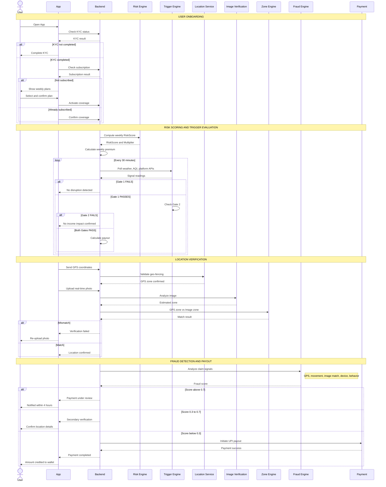

# Aegis — AI-Powered Parametric Wage Protection for Gig Workers

> **Guidewire DEVTrails 2026 | Phase 1 Submission**

> **Team Name:** Zero Noise Crew

> **Persona:** Food Delivery

> Platform: Mobile-first (Flutter) · Architecture: B2C with Platform Data Integration

---

## 1. The Problem

India's food delivery partners earn only when they ride. A single rain event, a red-alert pollution day, or a sudden curfew can wipe out an entire dinner rush - with zero recourse.

**Meet Shiva, 24, T. Nagar, Chennai.**
He delivers for Zomato full-time, averaging ₹700–₹1,000/day across 8–10 hours. His peak windows are lunch (12–2 PM) and dinner (7–10 PM). During Chennai's northeast monsoon season (October–December), a single flooded evening costs him ₹400–₹600 with no way to recover it. Chennai also faces intense summer heat (April–June regularly exceeding 40°C) and cyclone threats from the Bay of Bengal. He has no insurance, no sick pay, and no employer. When disruption hits, he absorbs 100% of the loss.

**Workers like Shiva lose 20–30% of monthly income to uncontrollable disruptions.** No insurance product in India was ever designed to cover this gap.

### Persona-Based Scenarios

| Scenario | Disruption | Shiva's Reality | Aegis Response |
|---|---|---|---|
| Chennai northeast monsoon flood | Rainfall >65mm, IMD red alert | Roads waterlogged, zero orders for 3 hrs | Auto-payout for dinner rush loss |
| T. Nagar heat crisis | Temp >41°C + working hours drop >25% | Lunch rush impossible, unsafe to ride | Heat + activity drop trigger fires |
| Cyclone warning, coastal Chennai | IMD cyclone alert, wind >60km/h | Platform suspends zone, all riders offline | Cyclone trigger fires, instant credit |
| Sudden local curfew | Section 144, zone sealed | All riders go offline in cluster | Geospatial anomaly detected, payout approved |

---

## 2. Solution - Aegis

Aegis is an **AI-enabled parametric insurance platform** that protects food delivery partners from income loss caused by external disruptions. It replaces slow, manual claim insurance with a **zero-touch, event-driven payout system** that works silently in the background once a worker signs up.

**No claim form. No approval wait. Zero manual steps after onboarding.**
A disruption is detected → worker's activity is validated → payout fires automatically to UPI.

### How It Works

Shiva downloads the Aegis app once, completes KYC, and selects his weekly plan. From that point, everything is fully automatic. Aegis pulls his earnings and activity data from Zomato/Swiggy in the background via platform APIs, monitors his zone for disruptions 24/7, and credits his UPI wallet the moment a trigger fires. He never opens the app to file a claim — the app is only for onboarding, coverage visibility, and payout history.

```
WORKER (Flutter App)
    ↕ onboarding, coverage view, payout notifications
AEGIS BACKEND (Node.js + FastAPI)
    ↕ earnings data, activity, GPS          ↕ weather, AQI, civic alerts
Mock Platform APIs (Zomato/Swiggy)     External APIs (OpenWeatherMap, CPCB, IMD)
```

**Why a dedicated app, not platform-embedded:**
- Shiva may multi-app across Zomato and Swiggy — a single Aegis app gives him unified coverage across both platforms from one place
- Direct app relationship means Aegis owns the worker data and trust, not the platform

---
## Platform Choice — Mobile App vs Web App
 
### Why We Chose a Mobile-First Approach
 
Aegis is built as a **mobile-first application**, with a web dashboard reserved exclusively for admin and operations teams. This was not a default decision — it was a deliberate design choice rooted in who our users are and how they live.
 
---
 
### The Core Reasoning
 
Shiva — our target user — does not sit at a desk. He is on a bike, on the road, in the rain. His only computer is his smartphone. When a disruption hits and a payout needs to happen, a web app is completely inaccessible to him. A mobile app is already in his pocket.
 
---
 
### What Each Platform Handles
 
#### Mobile App — Flutter (Worker-Facing)
The mobile app is the core product. It handles everything the worker interacts with:
 
- KYC onboarding and Aadhaar verification
- Weekly plan selection and UPI payment
- Real-time disruption alerts via push notifications
- Claim status tracking and payout confirmation
- Photo upload for Tier 2 soft-flag verification
- On-device telemetry (accelerometer, GPS, mock location detection) — critical for the anti-spoofing engine
 
#### Web App — React.js (Admin-Facing Only)
The web dashboard is built for insurance operations teams who work on desktop:
 
- Live disruption monitoring and trigger status
- Claims pipeline and fraud flag queue
- Worker image upload verification panel
- Financial metrics, loss ratio, and payout SLA tracking
- AI prediction reports and zone-level risk heatmaps
- Admin controls for policy management
 
---

## 3. Parametric Trigger System

A payout fires only when **both gates pass**. No exceptions.

**Gate 1 - External Disruption Signal** (confirms a qualifying event is occurring in the worker's zone)
**Gate 2 - Business Impact Signal** (confirms real income loss is happening, not just bad weather)

### Trigger Table

| Category | Trigger | Threshold | Payout % | Data Source |
|---|---|---|---|---|
| Weather | Heavy Rainfall | >65mm / 3hrs AND IMD orange/red alert | 80% | OpenWeatherMap + IMD |
| Weather | Severe Flooding | >120mm / 6hrs | 100% | OpenWeatherMap + IMD |
| Weather | Extreme Heat | Temp >41°C for 4+ hrs AND worker activity drop >25% | 75% | OpenWeatherMap |
| Weather | Cyclone / Storm | Wind >60 km/h AND IMD cyclone alert issued | 100% | IMD API |
| Environment | Hazardous AQI | AQI >300 AND order volume drop >30% | 80% | CPCB AQI API |
| Civic | Curfew / Section 144 | Active zone curfew confirmed | 90% | NDMA / data.gov.in |
| Civic | Transport Strike | Zone blocked >3 hrs | 75% | Civic Alert API (mock) |
| Platform | Zone Suspension | Zomato/Swiggy officially halts zone | 85% | Simulated Platform API |

> If multiple triggers fire simultaneously, the worker receives the **highest single payout** — not stacked payouts. This keeps the model financially sustainable.

> **Data basis for payout percentages:** IMD historical records show Chennai averages 18–22 red-alert rain days/year concentrated in the northeast monsoon (October–December), with near-total delivery halts during peak flooding, supporting 80–100% replacement for weather triggers. Chennai's summer heat (April–June) regularly exceeds 40°C — CPCB and IMD data show outdoor work reduces sharply above 41°C, supporting the 75% heat trigger. CPCB AQI data shows AQI >300 days result in partial (not full) work stoppages, supporting 70–80% for pollution triggers. A 2023 Fairwork India report documented gig workers losing 60–80% of daily income during platform outages, supporting the 65–85% range for platform triggers. In production, all percentages would be actuarially calibrated using zone-level historical disruption frequency and verified earnings loss data.

### Dual-Gate Logic

```
Gate 1 PASSES (e.g. Rainfall > 65mm confirmed by IMD)
    +
Gate 2 PASSES (e.g. Order volume drop > 30% vs 7-day rolling avg)
    +
Worker GPS places them in the affected zone
    +
Worker app was in active/online status for ≥ 45 mins during window
    ↓
PAYOUT FIRES AUTOMATICALLY
```

If Gate 1 passes but Gate 2 fails → no payout (weather was bad but business impact didn't materialise).
If neither passes → no action.

### Payout Calculation

```
Payout = (Worker's Verified Hourly Rate × Disruption Hours Lost) × Trigger Payout %
```

The hourly rate is calculated from the worker's 12-week trailing earnings average — locked in at policy start. The worker cannot be underpaid because a single bad week brought the average down.

---

## 4. Weekly Premium Model

Aegis uses a **dynamic weekly premium** that mirrors each worker's own earnings profile. A high earner pays a higher premium but also receives higher protection. A casual worker pays less and is covered proportionally.

### Formula

```
Weekly Premium = BASE × RiskMultiplier × LoyaltyFactor × ZoneFactor
```

| Variable | Description | Range |
|---|---|---|
| BASE | Derived from worker's 12-week trailing avg earnings × 0.75% | Personalised |
| RiskMultiplier | Computed from live RiskScore (weather, AQI, order trends) | 1.0 – 1.4 |
| LoyaltyFactor | Discount for workers with no claims in past 12 weeks | 0.85 – 1.0 |
| ZoneFactor | Adjusts for geographic flood/disruption history of the worker's zone | 0.95 – 1.10 |

> **Data basis for premium rates:** The 0.75% base rate is anchored to PMFBY (Pradhan Mantri Fasal Bima Yojana) crop microinsurance benchmarks, which use 1.5–2% of sum insured for similar high-frequency low-severity products. Gig weekly income cycles are shorter and more predictable than crop cycles, making 0.75% a conservative starting estimate. Multiplier ranges (1.0–1.4) are calibrated to keep final premiums under ₹100/week for the majority of workers while still reflecting real zone and seasonal risk variation. Production rates would be refined using 2–3 years of zone-level claim frequency data.

### Illustrative Examples

| Worker Type | Avg Weekly Earnings | Base Rate | Zone Factor | Season Factor | Weekly Premium |
|---|---|---|---|---|---|
| Full-time (peak zone) | ₹7,000 | 0.75% | 1.10 (flood zone) | 1.3 (monsoon) | ~₹75 |
| Regular rider | ₹4,500 | 0.75% | 1.0 (normal) | 1.0 (dry season) | ~₹34 |
| Casual / part-time | ₹1,800 | 0.75% | 0.95 (safe zone) | 1.0 | ~₹13 |

### Risk Score (Drives RiskMultiplier)

Each active condition contributes a weighted score:

| Condition | Weight |
|---|---|
| Rainfall > 65mm | +1.0 |
| Temperature > 41°C | +0.9 |
| AQI > 300 | +0.8 |
| Order volume drop > 30% | +1.0 |
| Earnings drop > 20% | +0.9 |

```
RiskMultiplier = 1 + 0.4 × min(RiskScore / 8, 1)
```

More active disruption conditions → higher RiskScore → higher multiplier → premium adjusts upward for that week.

### Coverage Continuity

If a worker's weekly earnings are too low to cover the premium deduction (e.g. after consecutive disruption weeks), the platform fronts the premium and recovers it across the next two earning weeks. Workers stay covered during their worst weeks — exactly when they need it most.

---

## 5. AI & ML Architecture

Aegis uses a layered AI system where each model solves a specific problem. No single model does everything.

| Model | Type | Purpose | When It Runs |
|---|---|---|---|
| **XGBoost** | Gradient Boosted Trees | Worker risk scoring + premium band assignment | Onboarding + weekly pricing cycle |
| **Isolation Forest** | Unsupervised Anomaly Detection | Per-claim fraud detection | Every claim event |
| **CNN Image Classifier** | Computer Vision | Photo evidence validation (weather, environment) | Flagged / suspicious claims |
| **NetVLAD / Place Recognition** | Visual Place Recognition | Location verification from uploaded images | Image-based verification flow |
| **Graph Neural Network (GNN)** | Graph-based ML | Coordinated fraud ring detection across users/devices | Phase 3 — batch + real-time |
| **Rule-Based Multiplier** | Deterministic Logic | Transparent weekly premium calculation | Weekly pricing update |

### Model Interaction Flow

```
Worker Activity
    → Feature Extraction
    → Risk Scoring (XGBoost) → Premium Adjustment (Rule Engine)
    → Claim Event Triggered
        → Anomaly Detection (Isolation Forest)
        → Image Verification (CNN + NetVLAD) [if flagged]
        → Location Cross-Check (GPS + Image Zone Match)
    → Final Decision: Approve / Hold / Flag
```

### Fraud Score Thresholds

| Score Band | Action |
|---|---|
| Score < 0.3 | Auto-approved → instant UPI payout |
| Score 0.3 – 0.7 | Hold → secondary verification → resolved within 4 hours |
| Score > 0.7 | Blocked → admin alert + manual review |

A flagged claim is **held, never silently rejected**. Workers are notified immediately with a reason and can appeal within 48 hours.

---

## 6. Fraud Detection & Anti-Spoofing
 
> *"A claim is trusted only when location, behavior, and activity signals consistently align."*
 
Aegis uses a **three-layer fraud detection system**. A claim must pass all three before a payout fires.
 
### Layer 1 - Multi-Factor Behavioral Analysis (Isolation Forest)
 
An **Isolation Forest** model scores every claim across five signals simultaneously:
 
| Signal | Fraud Indicator |
|---|---|
| GPS Consistency | Teleportation jumps or perfectly static coordinates |
| Movement Pattern | Zero movement for 2+ hrs during an "active" session |
| Order Activity | No orders accepted despite being "online" |
| Device Fingerprint | Multiple accounts on one device |
| Behavioral Anomaly | Logins only during disruption windows |
 
Unusual combinations isolate immediately — a genuine stranded worker produces a normal pattern; a fraudster does not.
 
### Layer 2 - Image × GPS Anti-Spoofing (CNN + NetVLAD)
 
GPS can be faked in seconds. Aegis cross-verifies a **live camera photo** against the GPS zone using two models:
 
```
Live photo captured (no gallery uploads allowed)
    → CNN extracts environment, weather cues, landmarks
    → NetVLAD maps image to geographic zone
    → GPS Zone = Image Zone  →  ✔ Verified
    → GPS Zone ≠ Image Zone  →  ❌ Flagged
```
 
**Hardening:** EXIF timestamp checked, recycled images rejected, same image hash cannot be reused.
 
### Layer 3 - Fraud Ring Detection (GNN — Phase 3)
 
A **Graph Neural Network** models workers as nodes and shared signals (device, GPS cluster, claim timing) as edges. A coordinated ring appears as a dense cluster — all claims from that zone are frozen and reviewed together.
 
### Fraud Score & Escalation
 
| Score | Action |
|---|---|
| < 0.3 | Auto-approved → instant UPI payout |
| 0.3 – 0.7 | Hold → resolved within 4 hours |
| > 0.7 | Blocked → admin review → worker notified |
 
A flagged claim is always held — never silently rejected. Workers can appeal within 48 hours. Score resets after 30 clean days.

---

## 7. System Architecture

> The Aegis system is structured across five decoupled layers — from real-time data ingestion through AI risk scoring, parametric trigger evaluation, multi-layer fraud validation, and automated UPI payout — ensuring each component can be updated or patched independently without affecting the rest of the pipeline.


---

## 8. Process Flow

> End-to-end flow from worker onboarding through KYC, subscription, risk scoring, dual-gate trigger evaluation, multi-layer location and fraud verification, and automated UPI payout.




---

## 9. Adversarial Defense & Anti-Spoofing Strategy
 
> 🚨 **Market Crash Response - Phase 1 Final 24 Hours**
> A syndicate of 500 workers is using GPS-spoofing apps to fake locations, trigger false payouts, and drain the liquidity pool. Here is how Aegis catches them — without punishing honest workers.
 
500 workers coordinating via Telegram spoof their GPS into a red-alert zone. A naive system pays them all. Aegis does not use basic GPS checks — here is why this attack fails.
 
---
 
### Requirement 1 - Genuine Worker vs GPS Spoofer
 
Aegis cross-validates **six independent signals** a spoofing app cannot simultaneously fake:
 
| Signal | Genuine Worker | Spoofer at Home |
|---|---|---|
| GPS coordinates | Inside affected zone | Faked ✓ (easy) |
| Movement pattern | Realistic drift, slow speed | Perfectly static or unnatural |
| Device network | Cell towers match claimed zone | Towers resolve to home location |
| Order activity | Orders attempted in zone before disruption | No zone order history in 48 hours |
| Image × GPS match | Photo shows flooded roads, rain | Photo shows indoors or recycled image |
| App behavior | Online before disruption started | App opened only during disruption window |
 
**All six signals must align for a payout to fire.**
 
---
 
### Requirement 2 - Detecting a Coordinated Fraud Ring
 
Aegis's GNN models every worker as a node — shared signals become edges. A ring is a dense cluster.
 
| Signal | What It Reveals |
|---|---|
| Claim timestamp clustering | 500 claims in 15 minutes = coordinated |
| Device family overlap | Shared device pool across accounts |
| GPS coordinate clustering | All locations in one tiny sub-zone |
| Image hash similarity | Recycled photos across accounts |
| Historical zone claim rate | Zone showing 40× its normal claim rate |
 
When a ring is detected → all zone claims frozen → admin alerted → zone flagged for 48 hours.
 
---
 
### Requirement 3 - Protecting Honest Workers from False Flags
 
**Core principle: freeze, never silently reject.**
 
| Scenario | What Aegis Does |
|---|---|
| GPS drops briefly in bad weather | Pre-disruption order history confirms presence — auto-approved |
| Image upload fails | 30-minute retry window before flagging |
| Medium fraud score (0.3–0.7) | Claim held — in-app notification within 5 minutes |
| Manual review triggered | Resolved within 4 hours — worker notified either way |
| Worker disputes payout | In-app appeal → 24-hour review → raw evidence shown |
 
Never silently rejects. Never permanently flags on a single event. Everything handled in-app.
 
**Honest worker test:** Shiva is stuck in the T. Nagar flood. His GPS drops briefly. Fraud score touches 0.35 — claim held for 4 hours, pre-disruption activity clears it. ₹480 credited. Two in-app notifications. Zero action required from Shiva.

That is the experience Aegis is designed to deliver.

---

## 10. Tech Stack

| Layer | Technology | Purpose |
|---|---|---|
| Mobile App (Worker) | Flutter | Cross-platform Android/iOS — single codebase, native UPI deep-linking |
| Admin Dashboard | React.js + Tailwind CSS | Real-time fraud, trigger, and analytics monitoring |
| Backend / API | Node.js + Express.js | Business logic, authentication, orchestration |
| AI / ML Engine | Python + scikit-learn + FastAPI | Risk scoring, fraud detection, anomaly detection — served as independent microservice |
| Database | PostgreSQL | Workers, policies, claims, transactions |
| Cache / Real-Time State | Redis | Live trigger state, session data, zone status |
| Authentication | JWT | Secure session handling |
| Payment | Razorpay Test Mode | Simulated instant UPI payout |
| Weather | OpenWeatherMap API | Rainfall, temperature triggers |
| Air Quality | CPCB AQI API | Pollution-based disruption detection |
| Geolocation | Google Maps API / Mapbox | Geo-fencing, zone detection, GPS validation |
| Platform Simulation | Mock REST APIs (Node.js) | Simulated Zomato/Swiggy order volume and zone status |

**Why Flutter:** Delivery partners are Android-first, low-storage users. Flutter provides a single codebase for Android and iOS with native-grade performance, offline support, and direct UPI deep-linking — critical for zero-friction payout notifications.

---

## 11. Business Viability

Aegis sits as the **AI technology layer** between gig workers and IRDAI-licensed insurers. It does not carry insurance risk — it provides the intelligence that makes parametric insurance possible for a segment no traditional insurer has ever been able to price accurately.

### Revenue Model

```
Shiva pays ₹34/week premium
    → flows to IRDAI-licensed underwriter partner
    → Aegis earns a technology fee per active policy
    → underwriter pays valid claims via Aegis payout engine
```

### Why This Business Works

**Distribution advantage**
Zomato and Swiggy together have 5M+ active delivery partners in India. A single platform partnership gives Aegis access to this entire worker base — without spending on user acquisition. No ads, no referrals, no cold outreach. The platform already has Shiva's trust.

**Minimal regulatory burden**
Aegis is a technology provider and insurance intermediary — not an insurer. The IRDAI-licensed underwriter partner carries the regulatory license and balance sheet risk. Aegis's compliance obligations are significantly lighter, which means faster product iteration and lower legal overhead.

**The cross-platform AI advantage**
Aegis ingests earnings, activity, and GPS data from both Zomato and Swiggy workers simultaneously. This cross-platform dataset is the core of the AI risk models — it captures patterns that neither platform can see on its own. A Zomato-only or Swiggy-only model would be blind to workers who multi-app across both. Aegis is not. This makes the fraud detection and risk scoring models significantly more accurate, and neither platform can replicate them without the other's data.

**Unit economics**

| Metric | Value |
|---|---|
| Average weekly premium per worker | ₹34 |
| Active workers (target Year 1) | 1,00,000 |
| Weekly premium flow | ₹34 lakhs/week |
| At 1M workers (scale) | ₹34 Cr/week |
| Estimated loss ratio (non-monsoon) | ~78% |
| Estimated loss ratio (monsoon peak) | ~88% |

> **Data basis for loss ratios:** IRDAI Annual Report 2022–23 shows Indian general insurers average 75–82% loss ratios for high-frequency, low-severity parametric products. The 78% non-monsoon estimate sits at the midpoint of this range. The 88% monsoon peak estimate reflects Chennai's documented 18–22 red-alert rain days concentrated in October–December (northeast monsoon), compressing claims into a short 3-month window — a tighter seasonal spike than most Indian cities. Both figures are estimates — production loss ratios would be modelled using zone-level disruption frequency data over a minimum 2-year baseline.

> A 78% loss ratio means for every ₹100 in premium collected, ₹78 is paid out as claims and ₹22 covers operations and technology fees — viable for both Aegis and the underwriter partner.

---

## 12. Development Roadmap

### Phase 1 (March 4–20) — Ideation & Foundation ✅
- Architecture design and documentation
- Persona research and scenario mapping
- Parametric trigger and risk model design
- Tech stack selection and mock API schema definition

**Phase 1 Strategy Video:** [Watch on YouTube](https://youtu.be/Pzlo5yZmJCo)

### Phase 2 (March 21 – April 4) — Automation & Protection
- Worker registration flow (simulated platform handshake)
- Dynamic weekly premium calculation engine (live)
- 3–5 automated parametric triggers wired to mock APIs
- Zero-touch claims management module
- 2-minute demo video

### Phase 3 (April 5–17) — Scale & Optimise
- Advanced fraud detection (GPS × image cross-verification, GNN fraud ring detection)
- Geospatial anomaly detection for zero-day civic events
- Dual dashboard: Worker view + Admin/Insurer view
- Simulated instant UPI payout via Razorpay test mode
- Final pitch deck + 5-minute demo video

---

## 13. Team
> Team Name: Zero Noise Crew

| Name | Role | Responsibility |
|---|---|---|
| Muthu Harish T | Team Lead / Full Stack + AI | Architecture, AI model development, backend integration |
| Rithanya S | Backend Developer | API development, database management, system logic |
| Harini Nachammai P | Flutter Developer | Mobile app, UI implementation, app integration |
| Nivaashini Thangaraj | Web + Data Engineer | Admin dashboard (React), data pipelines, risk scoring |
| Abithi V B | QA + ML Engineer | Testing, validation, ML evaluation, fraud detection |

---

*Aegis — Parametric wage protection for Chennai's invisible delivery workforce.*
*Phase 1 Submission · March 20, 2026*
